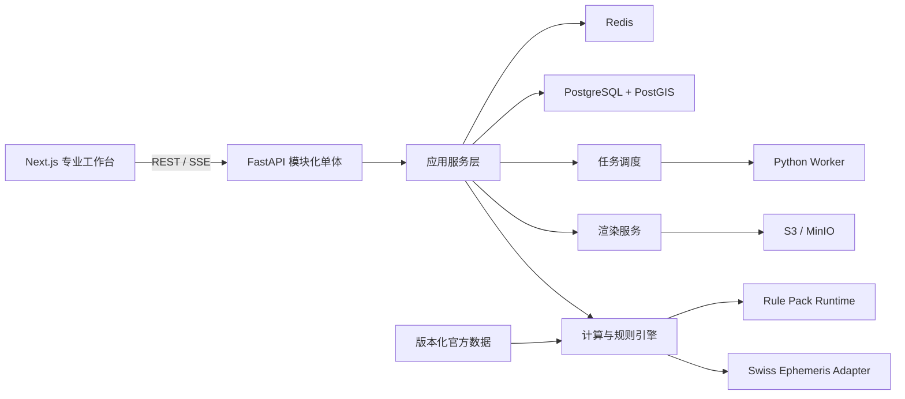

# Interstellar V1 技术开发说明书

| 字段 | 值 |
|---|---|
| 文档版本 | 1.3.0-draft.1 |
| 基线日期 | 2026-07-18 |
| 产品版本 | Interstellar V1 |
| 研发周期 | 24 个月；第 6 个月交付 Professional Alpha |
| 目标读者 | 产品负责人、开发者、测试人员、占星算法审核者、运维人员 |
| 技术栈 | Next.js + TypeScript；FastAPI + Python；PostgreSQL/PostGIS；Redis；S3/MinIO |
| 发布方式 | AGPL 开源；公共限流服务；Docker Compose 自托管 |

本说明书是 V1 的研发基线。开发任务、接口、数据模型、测试和发布验收共同以本文、[分析入口、模型、目的与报告目录](./analysis-catalog.yaml)、[机器可读计算目录](./calculation-catalog.yaml)、[全量计算与结果说明](./calculation-result-catalog.md)、[146项图形目录](./render-catalog.yaml)及[能力矩阵](./capabilities.yaml)为准。涉及占星流派差异或复杂公式的工作项，必须先根据[算法卡模板](./algorithm-card-template.md)完成算法卡；没有算法卡的能力不得标记为 `Stable`。

五份规范的职责不可互相替代：本文定义架构和开发方式；分析目录定义“用户如何进入、模型如何组合、报告如何形成”；计算目录定义“算什么、返回什么”；图形目录定义“画什么、消费哪些结果”；能力矩阵定义阶段、依赖、成熟度和测试状态。任何实现只有同时完成五方追踪才算进入范围。

## 1. 目标、范围与约束

### 1.1 V1 目标

构建面向职业占星师、占星学习者和重度爱好者的西方占星专业计算平台，提供：

- 可复现、可追溯、可验证的确定性占星计算；
- 专业 Web 工作台与版本化 REST API；
- 本命、预测、关系、古典、卜卦、择时、地理和世运能力；
- 12个版本化内置AnalysisModel和专家自定义组合校验；
- 24个版本化TopicModel、35个AnalysisIntent、六类入口和统一AnalysisRecipe解析；
- 六类非AI报告、三种展示密度、结构化Finding与可下钻证据链；
- 结构化证据链，不输出没有依据的综合评分；
- 中英文界面、字段、错误和开发文档；
- SVG/PNG/PDF/JSON/CSV/ICS/项目归档导出；
- 匿名计算和可选云端工作区；
- 允许后续接入新占术系统的公共平台协议。
- 完整实现机器可读目录当前登记的99项专业计算基线，并为每项结果生成可追踪的 `OutputManifest`；
- 逐项交付图形目录编号1—128；编号129—146属于V1后消费者产品，但必须在总目录保留稳定 `view_id` 和数据依赖。

### 1.2 V1 不做

- AI 解读、AI 对话、自然语言控制；
- 普通消费者简化模式、每日推送和订阅内容；
- CRM、预约、支付、咨询交付、团队协作；
- 八字、紫微斗数、奇门遁甲和印度占星的领域实现；
- 原生 iOS/Android 应用；
- 企业级 SLA、多区域高可用和大规模分析仓库；
- 商业 App 内容抓取、专有规则逆向或 Astro-Databank 爬取；
- 付费数据源和闭源发行。

### 1.3 强制工程原则

1. **计算与解释分离**：计算引擎只输出事实和规则命中，文本层不反向修改计算结果。
2. **输入不可歧义**：未知出生时间不得自动写成 `00:00`；历史时区存在多个候选时必须返回候选集和可信度。
3. **结果不可变**：每次计算生成不可变 `CalculationSnapshot`，引用准确的对象版本、引擎版本、数据版本和规则哈希。
4. **流派显式**：宫位制、黄道体系、Ayanamsa、容许度、尊贵表和技法变体不得使用隐式默认值。
5. **能力分级**：所有能力标注 `Stable`、`Beta` 或 `Experimental`。
6. **零爬虫**：核心数据仅通过官方发布包、Dump、API、TAP 或经授权人工导入获取。
7. **可替换适配器**：Canonical Schema 不依赖 Kerykeion、Swiss Ephemeris 或任一具体库的返回结构。
8. **同源渲染**：屏幕和导出共享 `RenderSpec`，避免前后端各自解释计算结果。
9. **目录即范围**：禁止以“已支持轮盘/预测/关系”等家族声明代替逐项实现；计算以 `calculation_id`、图形以 `view_id` 验收。
10. **可追踪覆盖**：每个公开结果必须回溯到计算条目、能力、算法卡和数据版本；每个图必须只消费 Canonical Result，不得在渲染层补算占星事实。

## 2. 总体架构



### 2.1 模块化单体边界

| 模块 | 主要职责 | 禁止职责 |
|---|---|---|
| `identity` | 用户、会话、Workspace、权限 | 占星计算 |
| `subjects` | Subject、SubjectVersion、关系与项目对象 | 修改历史版本 |
| `time_location` | TimeSpec、地名、时区候选、历史警告 | 隐式修正用户时间 |
| `calculations` | 请求标准化、计算流水线、快照 | 生成长篇解释文本 |
| `analysis_models` | 分析模型注册、兼容性解析、技法编排和输出清单 | 隐式改变技法、规则或默认参数 |
| `analysis_recipes` | 六类入口、分析草案、依赖DAG、预检计划和按需计算 | 绕过预检直接全量计算 |
| `techniques` | 本命、预测、关系、古典等领域算法 | 直接依赖 HTTP/UI |
| `rules` | Rule Pack 校验、哈希、执行、证据 | 执行未授权代码 |
| `reporting` | Evidence/Finding/Conclusion聚合、章节组装、模板和报告版本 | 从原始数据无规则生成判断 |
| `rendering` | RenderSpec、SVG/PNG/PDF、图表布局 | 重算天体位置 |
| `jobs` | 长任务、进度、取消、重试、超时 | 持有领域状态真相 |
| `datasets` | 数据版本、来源、许可证、同步状态 | 静默更新线上结果 |
| `imports_exports` | CSV/JSON/ICS/项目归档 | 导出明文密钥或凭据 |
| `sharing` | 可撤销、可过期分享 | 永久公开私有对象 |
| `observability` | 日志、指标、审计、追踪 | 记录明文出生资料 |

### 2.2 建议仓库结构

```text
apps/
  web/                    Next.js 工作台
  api/                    FastAPI 应用与模块
  worker/                 异步任务 Worker
packages/
  canonical-schema/       OpenAPI/JSON Schema/生成类型
  render-spec/            渲染协议和前端组件
  ui/                     共享设计系统
python/
  interstellar_core/      领域模型、计算流水线、适配器
  interstellar_rules/     Rule Pack 编译和运行时
  interstellar_render/    服务端渲染
data-manifests/           官方数据版本与许可证清单
algorithm-cards/          已批准算法卡
tests/
  gold/                   金标准样本
  differential/           独立实现差异测试
  contracts/              API/Schema 契约
docs/                     研发与项目文档
```

`packages/canonical-schema` 是跨语言契约的唯一来源。Python 和 TypeScript 类型由 Schema 生成，不允许维护两套手写、可能漂移的公共类型。

### 2.3 固定实现选型

| 层 | 选型 | 约束 |
|---|---|---|
| Web | Next.js App Router、TypeScript strict、React、TanStack Query、Zod | 服务端状态由Query管理；只在确有跨视图交互状态时使用轻量Store |
| UI | CSS Variables设计令牌、Radix Primitives或等价无障碍基础组件 | 不绑定商业组件库；打印和深浅主题共享令牌 |
| API | FastAPI、Pydantic v2、SQLAlchemy 2 async、Alembic、psycopg | 路由不得直接调用Swiss；必须经过应用服务和领域接口 |
| Worker | Celery 5 + Redis broker | Job真相写PostgreSQL；Celery结果后端不作为公共状态来源 |
| 数据库 | PostgreSQL + PostGIS | JSONB快照不可变；租户表强制RLS |
| 对象存储 | S3兼容接口；本地MinIO | 数据库只保存对象键、哈希、大小和MIME |
| Schema | JSON Schema + OpenAPI | 使用代码生成产出TS/Python客户端模型 |
| 测试 | Pytest、Hypothesis、Vitest、Playwright | 金标准和差异测试作为独立测试套件 |
| 渲染 | 浏览器TypeScript SVG组件；Playwright确定性导出PNG/PDF | 服务端导出调用内部只读渲染路由，复用同一RenderSpec和组件 |

运行时版本通过仓库工具版本文件和锁文件固定；升级框架或计算库必须独立提交，并先运行契约、金标准和视觉回归。

## 3. 研发工作包

每个工作包必须在 Issue 中引用对应编号、能力矩阵 ID 和算法卡 ID。

| ID | 月份 | 优先级 | 工作包 | 依赖 | 主要交付 |
|---|---:|---|---|---|---|
| V1-FND-001 | M0-M1 | P0 | Monorepo、CI、Docker Compose | 无 | 可启动的 Web/API/Worker/Postgres/Redis/MinIO |
| V1-SCH-001 | M0-M1 | P0 | Canonical Schema与全量结果契约 | V1-FND-001 | 公共类型、OpenAPI、类型生成、计算目录结果Schema |
| V1-TIM-001 | M0-M1 | P0 | TimeSpec 与历史时区 | V1-SCH-001 | 时间候选、可信度、DST异常处理 |
| V1-SUB-001 | M0-M1 | P0 | Subject/Version/Workspace | V1-SCH-001 | 不可变版本和 RLS |
| V1-MDL-001 | M0-M2 | P0 | AnalysisModel Schema与内置模型注册表 | V1-SCH-001,V1-SUB-001 | 模型版本、兼容性、技法编排、输出Manifest |
| V1-RCP-001 | M0-M3 | P0 | AnalysisDraft、AnalysisRecipe与解析器 | V1-MDL-001,V1-SUB-001 | 六类入口、依赖DAG、预检、缓存复用和可达性校验 |
| V1-CAT-001 | M0-M3 | P0 | TopicModel与AnalysisIntent目录 | V1-MDL-001,V1-RCP-001 | 24个专题模型卡、35个目的及对象快捷映射 |
| V1-DAT-001 | M0-M2 | P0 | 数据清单和同步框架 | V1-FND-001 | DatasetVersion、来源和许可台账 |
| V1-ENG-001 | M1-M3 | P0 | 计算流水线与 Swiss Adapter | V1-SCH-001,V1-TIM-001,V1-DAT-001 | 标准化输入到快照 |
| V1-NAT-001 | M2-M4 | P0 | 本命基础计算 | V1-ENG-001 | 天体、轴点、宫位、相位、统计 |
| V1-REL-001 | M3-M5 | P0 | 比较盘与组合盘 | V1-NAT-001 | 跨盘相位、宫位覆盖、组合盘 |
| V1-TRN-001 | M3-M5 | P0 | 行运和返照 | V1-NAT-001,V1-JOB-001 | 事件命中和太阳/月亮返照 |
| V1-RND-001 | M2-M6 | P0 | 基础渲染 | V1-SCH-001,V1-NAT-001 | 单/双轮、网格、表、PNG/SVG |
| V1-UI-001 | M1-M6 | P0 | 对象驱动工作台 Alpha | V1-SUB-001,V1-MDL-001,V1-RND-001 | 示例对象、新增对象、选内容、选模型、参数、结果、证据和导出 |
| V1-JOB-001 | M1-M4 | P0 | 异步任务与 SSE | V1-FND-001 | 进度、取消、重试、限流 |
| V1-API-001 | M1-M6 | P0 | 公共 REST API Alpha | V1-SCH-001,V1-ENG-001,V1-JOB-001 | `/api/v1` 契约 |
| V1-MDL-002 | M2-M6 | P0 | Alpha分析模型 | V1-MDL-001,V1-NAT-001,V1-REL-001,V1-TRN-001 | 现代本命、短期行运、关系比较 |
| V1-SEC-001 | M1-M6 | P0 | 隐私、RLS、加密、分享 | V1-SUB-001 | 安全边界和审计 |
| V1-PRG-001 | M7-M10 | P1 | 次限、三限、太阳弧 | V1-NAT-001 | 推运类快照和时间线 |
| V1-REL-002 | M7-M10 | P1 | 戴维森与动态关系 | V1-REL-001,V1-PRG-001 | 关系盘和动态触发 |
| V1-CLS-001 | M7-M12 | P1 | 尊贵、接纳、格局、阿拉伯点 | V1-NAT-001,V1-RULE-001 | 古典派生指标 |
| V1-MID-001 | M7-M12 | P1 | 中点与谐波 | V1-NAT-001 | 中点树、谐波盘 |
| V1-EVT-001 | M7-M12 | P1 | 统一事件搜索器 | V1-TRN-001,V1-JOB-001 | 区间搜索、精确命中、反复触发 |
| V1-RND-002 | M7-M12 | P1 | 专业图形 Beta | V1-EVT-001,V1-PRG-001 | 三/四轮、图形星历、甘特图、PDF |
| V1-RULE-001 | M7-M13 | P1 | Rule Pack Runtime | V1-SCH-001 | JSON/YAML声明式规则、证据链 |
| V1-RPT-001 | M4-M12 | P1 | 报告Schema与技术报告引擎 | V1-RCP-001,V1-RND-001 | 六层报告对象、计算记录/技法报告、三种密度和结构化HTML/PDF |
| V1-MDL-003 | M7-M18 | P1 | 高级分析模型 | V1-MDL-002,V1-PRG-001,V1-CLS-001,V1-RULE-001 | 古典、希腊化、综合本命、年度、长期、专项和地理模型 |
| V1-TML-001 | M13-M16 | P1 | 小限、法达、黄道释放 | V1-CLS-001,V1-RULE-001 | 时间主星周期 |
| V1-DIR-001 | M13-M18 | P1 | 主限和高级弧向 | V1-PRG-001 | 方向法计算和时间线 |
| V1-HOR-001 | M13-M18 | P1 | 卜卦规则引擎 | V1-CLS-001,V1-RULE-001 | 象征星、接纳、完成规则 |
| V1-ELE-001 | M13-M18 | P1 | 择时约束优化 | V1-EVT-001,V1-RULE-001 | 候选时间扫描和排序 |
| V1-GEO-001 | M13-M18 | P1 | 迁移与地理占星 | V1-TIM-001,V1-DAT-001,V1-RND-002 | A*C*G、Local Space、Paran |
| V1-TOP-001 | M13-M18 | P1 | 结构化主题模型 | V1-RULE-001,V1-TML-001 | 基线、激活、支持、压力、确定度 |
| V1-MUN-001 | M19-M22 | P2 | 世运、国家、公司、项目 | V1-EVT-001,V1-GEO-001 | 组织与事件周期 |
| V1-MDL-004 | M19-M24 | P1 | V1分析模型目录稳定化 | V1-MDL-003,V1-MUN-001,V1-TOP-001 | 12个内置模型、兼容性矩阵、模型卡、迁移和SDK |
| V1-RPT-002 | M13-M24 | P1 | 正式报告规则与专业复核 | V1-RPT-001,V1-TOP-001,V1-MDL-004 | 六类报告、24个TopicModel报告状态、规则包、双语模板、样本和复核记录 |
| V1-RND-003 | M19-M23 | P1 | 专业V1全图形目录 | 全部计算能力 | `render-catalog.yaml`编号1—128逐项实现与视觉回归 |
| V1-LOC-001 | M19-M23 | P1 | 中英文和无障碍 | V1-UI-001,V1-RND-003 | 双语、打印、键盘、色盲支持 |
| V1-REL-003 | M19-M23 | P1 | SDK、归档与兼容性 | V1-API-001 | TS/Python SDK、可重导入归档 |
| V1-GATE-001 | M23-M24 | P0 | V1 稳定化与审计 | 全部 | 专业评审、许可、安全、性能、发布 |

### 3.1 工作包完成定义

一个工作包只有同时满足以下条件才可关闭：

- 公共输入、输出和错误行为已写入 Schema/OpenAPI；
- 代码不绕过模块边界；
- 算法卡、数据来源和许可证已登记；
- 单元、属性、金标准和必要的差异测试通过；
- UI能力具备键盘操作、空状态、加载、错误和警告状态；
- 日志不包含明文敏感出生资料；
- 文档、示例、变更记录和能力矩阵状态同步；
- 性能预算没有回退，或已记录并批准例外；
- `Stable` 能力完成专业复核。
- 工作包声明的全部 `calculation_id` 和 `view_id` 已在 `OutputManifest`、契约测试和目录覆盖报告中闭环。

## 4. Canonical Domain Schema

### 4.1 公共枚举

内部和 API 枚举使用稳定英文值；UI按语言包显示。

```text
SubjectKind       person | event | project | organization | country | relationship | question | location
TimePrecision     second | minute | quarter_hour | hour | part_of_day | date | interval | unknown
TimeConfidence    high | medium | low | disputed | unknown
Maturity          stable | beta | experimental
JobStatus         queued | running | succeeded | partial | failed | cancelling | cancelled | timed_out | expired
EvidencePolarity  support | pressure | neutral | counter
ChartFamily       natal | transit | progression | direction | return | relationship | horary |
                  electional | relocation | mundane | harmonic | custom
```

### 4.2 Subject 与版本

```json
{
  "id": "sub_01...",
  "workspace_id": "ws_01...",
  "kind": "person",
  "display_name": "Example",
  "current_version_id": "sv_01...",
  "created_at": "2026-07-17T12:00:00Z"
}
```

```json
{
  "id": "sv_01...",
  "subject_id": "sub_01...",
  "version": 3,
  "time_spec": {},
  "location": {},
  "attributes": {},
  "source": {"kind": "user", "note": null},
  "content_hash": "sha256:...",
  "created_at": "2026-07-17T12:00:00Z"
}
```

规则：

- `SubjectVersion`只允许创建和读取，不提供更新接口；
- 删除 Subject 默认软删除，历史快照保留版本引用；
- 匿名请求使用内联 Subject，不创建 Subject 或 SubjectVersion；
- Relationship 保存参与者版本引用，不复制出生资料；
- Project、Organization、Event 使用相同版本机制。

各对象版本的最小负载：

| SubjectKind | 必需字段 | 可选字段 | 不能默认 |
|---|---|---|---|
| `person` | 名称/代号、出生日期、时间精度、来源 | 出生时间、地点、标签、备注 | 未知时间不能补`00:00` |
| `relationship` | 至少两个参与者版本ID、关系类型 | 初识/承诺事件、地点、备注 | 不能自动选择参与者最新版本 |
| `event` | 名称、TimeSpec、Location、事件类型、来源 | 参与对象、备注 | 不能用创建记录时间代替事件时间 |
| `project` | 名称、主锚点事件和来源 | 立项/签约/上线等多个锚点、负责人、组织 | 必须由用户选择当前盘所用锚点 |
| `organization` | 名称、主锚点事件和来源 | 注册/开业/首笔交易等锚点、地点 | 不能假定注册日午夜 |
| `country` | 名称、主锚点事件、Location、来源 | 多个候选国家盘、政体版本 | 冲突国盘必须并列保存 |
| `question` | 问题原文、提问TimeSpec、Location、事项分类 | 派生宫位人工修正 | 不能由AI自动决定事项宫 |
| `location` | 名称、WGS84经纬度、来源 | 海拔、行政层级、城市实体ID | 不能用地图视口中心代替选择地点 |

关系、项目、组织和国家对象必须固定引用的对象版本；参与人物产生新版本时，系统只提示可升级，不得静默替换历史引用。

### 4.3 TimeSpec

```json
{
  "calendar": "gregorian",
  "local_value": "1987-05-10T02:30:00",
  "precision": "minute",
  "timezone_id": "Asia/Shanghai",
  "utc_candidates": ["1987-05-09T18:30:00Z"],
  "selected_utc": "1987-05-09T18:30:00Z",
  "confidence": "high",
  "source": {
    "kind": "user_record",
    "description": "birth certificate"
  },
  "manual_override": null,
  "warnings": []
}
```

约束：

- `precision=unknown`时，`local_value`只允许包含日期，宫位和轴点依赖能力必须拒绝或切换“无出生时间模式”；
- DST重复时返回两个 `utc_candidates`，用户必须选择，或请求以分支结果返回；
- DST空洞时返回 `TIME_NONEXISTENT_LOCAL`，不得自动平移；
- 1970年前的时区转换必须带数据版本和历史可信度；
- 手工修正记录修正前值、修正后值、理由和操作者；
- 儒略历和历史历法转换需独立算法卡。

### 4.4 Location

```json
{
  "name": "Shanghai",
  "country_code": "CN",
  "admin_path": ["Shanghai"],
  "latitude": 31.2304,
  "longitude": 121.4737,
  "elevation_m": 4,
  "timezone_id": "Asia/Shanghai",
  "geonames_id": 1796236,
  "source": "geonames",
  "source_version": "2026-07-17"
}
```

经纬度采用 WGS84；纬度范围 `[-90, 90]`，经度范围 `[-180, 180)`；任何地图服务返回值都必须先规范化为 Location，计算引擎不读取供应商特有字段。

### 4.5 ChartRequest

```json
{
  "subject": {"subject_version_id": "sv_01..."},
  "chart": {
    "family": "natal",
    "technique": "natal.standard",
    "reference_time": null,
    "reference_location": null
  },
  "settings": {
    "zodiac": "tropical",
    "house_system": "P",
    "center": "geocentric",
    "node_type": "true",
    "aspect_set_id": "official.modern_major.v1",
    "orb_profile_id": "official.default.v1"
  },
  "rule_pack_hash": "sha256:...",
  "dataset_versions": {},
  "outputs": ["snapshot", "svg"]
}
```

规范化后的请求必须包含所有默认值，并计算 `input_fingerprint`。同一规范化请求、引擎版本、规则哈希和数据版本必须得到相同结构化结果。

### 4.6 CalculationSnapshot

```json
{
  "id": "calc_01...",
  "schema_version": "1.0.0",
  "status": "succeeded",
  "request": {},
  "normalized_input": {},
  "input_fingerprint": "hmac-sha256:...",
  "engine": {"name": "interstellar-core", "version": "0.1.0"},
  "adapters": [{"name": "swiss-ephemeris", "version": "2.10.x"}],
  "datasets": [],
  "analysis_model": {
    "id": "forecast.annual_integrated.v1",
    "version": "1.0.0",
    "content_hash": "sha256:...",
    "expanded_components": [],
    "overrides": {},
    "degradations": []
  },
  "rule_pack_hash": "sha256:...",
  "maturity": "beta",
  "result": {
    "astronomical_context": {},
    "charts": [],
    "points": [],
    "houses": [],
    "aspects": [],
    "distributions": [],
    "patterns": [],
    "dignities": [],
    "receptions": [],
    "lots": [],
    "midpoints": [],
    "directions": [],
    "returns": [],
    "periods": [],
    "events": [],
    "relationships": [],
    "geography": [],
    "mundane": [],
    "topic_evidence": [],
    "output_manifest": []
  },
  "warnings": [],
  "created_at": "2026-07-17T12:00:01Z"
}
```

快照不可更新。重新计算生成新快照，并可通过 `supersedes_id`建立替代关系。

`result` 的完整字段、单位、空值语义和专项结果结构以[全量计算与结果目录](./calculation-result-catalog.md)第8章为准。上例只是顶层聚合结构，不允许据此省略目录中的字段。第三方 Adapter 的原始 JSON 不得直接写入公共结果。

### 4.7 Evidence

```json
{
  "id": "ev_01...",
  "topic": "career.role_change",
  "polarity": "support",
  "technique": "transit",
  "configuration": {
    "moving_point": "jupiter",
    "aspect": "conjunction",
    "natal_point": "mc",
    "orb_deg": 0.18
  },
  "active_window": {
    "start": "2026-08-12T00:00:00Z",
    "exact": ["2026-09-03T08:14:00Z"],
    "end": "2026-10-01T00:00:00Z"
  },
  "rule_id": "career.transit.jupiter_mc.v1",
  "weight": 0.9,
  "maturity": "beta",
  "sources": ["algorithm-card:TRN-001"]
}
```

V1主题输出只提供 `activity`、`support`、`pressure`、`confidence`和证据列表；不输出“成功概率”“复合概率”或无依据的单一好运分。

### 4.8 AnalysisModel 与 ModelVersion

`AnalysisModel`是面向用户的、不可变版本化的计算编排定义。它不是AI模型，也不是新的天文算法；它把一个分析目标所需的对象角色、底层能力、Rule Pack、默认参数和输出视图组成可复现的产品模型。

```json
{
  "id": "forecast.annual_integrated.v1",
  "version": "1.0.0",
  "content_hash": "sha256:...",
  "name_i18n": {
    "zh-CN": "年度综合分析",
    "en": "Integrated Annual Analysis"
  },
  "phase": "pro",
  "maturity": "beta",
  "compatible_topics": ["career", "relationship", "finance", "family", "general"],
  "subject_roles": [
    {"role": "primary", "kinds": ["person"], "min": 1, "max": 1}
  ],
  "time_requirement": {
    "minimum_precision": "minute",
    "range_required": true,
    "maximum_range_years": 2
  },
  "components": [
    {"capability_id": "forecast.transits", "required": true},
    {"capability_id": "forecast.returns", "required": true, "preset": {"return_body": "sun"}},
    {"capability_id": "forecast.secondary_progression", "required": true},
    {"capability_id": "timing.annual_profections", "required": true},
    {"capability_id": "topic.structured_evidence", "required": true}
  ],
  "default_rule_pack": "official.annual_integrated.v1",
  "allowed_overrides": ["house_system", "orb_profile_id", "return_location_policy"],
  "output_manifest": {
    "primary_views": ["wheel.tri_natal_return_transit", "timeline.multi_technique", "table.active_triggers"],
    "secondary_views": ["table.future_events", "calendar.returns", "grid.aspects"],
    "exports": ["svg", "png", "pdf", "json", "csv", "ics"]
  },
  "algorithm_cards": ["model:forecast.annual_integrated.v1"],
  "warnings": []
}
```

强制规则：

- `id`表达稳定语义，`version`使用语义版本；同一版本的`content_hash`不得改变；
- 模型版本、组件版本、Rule Pack哈希、所有默认值和用户覆盖项必须进入计算指纹；
- 模型只编排`capabilities.yaml`中存在的能力，不复制或重新实现算法；
- 模型不得静默跳过`required=true`组件；输入不足时必须返回阻断或明确的降级计划；
- 模型成熟度不得高于其必需组件中的最低成熟度；
- 内置模型只读；V1专家自定义只产生`CustomModelSpec`，不得冒充官方内置模型；
- 修改组件、默认参数、证据聚合或输出语义至少提升Minor版本；改变结论语义必须提升Major版本；
- 模型可输出结构化事实和证据，不在V1生成AI文本或客观事件概率。

### 4.9 V1内置分析模型目录

| 模型ID | 中文名称 | 首次阶段 | 必需对象 | 核心组件 | 主要输出 |
|---|---|---|---|---|---|
| `natal.modern.v1` | 现代本命分析 | Alpha | 1人物 | 本命、相位、格局、元素/模式 | 本命轮盘、结构表、重复主题证据 |
| `natal.classical.v1` | 古典本命分析 | Beta | 1人物 | 本命、昼夜、尊贵、接纳、宫主、阿拉伯点 | 古典轮盘、尊贵表、定位链 |
| `natal.hellenistic.v1` | 希腊化本命分析 | Pro | 1人物 | 整宫、昼夜、福点/精神点、主导星 | 整宫盘、主星链、Lots表 |
| `natal.integrated.v1` | 综合本命分析 | Pro | 1人物 | 现代＋古典＋希腊化＋主题证据 | 分流派结果、共同证据、分歧；禁止相互抵消 |
| `forecast.short_transit.v1` | 短期行运分析 | Alpha | 1人物＋时间范围 | 行运、进入、站点、精确相位、事件搜索 | 双轮、事件列表、短期时间线 |
| `forecast.annual_integrated.v1` | 年度综合分析 | Pro | 1人物＋目标年 | 行运、太阳返照、次限、年度小限、主题证据 | 三轮、年度时间线、返照日历、主题证据 |
| `forecast.long_cycle.v1` | 长期周期分析 | V1 | 1人物＋多年范围 | 次限、太阳弧、主限、法达、黄道释放 | 多技法时间线、阶段、重叠触发 |
| `relationship.comparison.v1` | 关系比较分析 | Alpha | 2人物 | 比较盘、跨盘相位、双向宫位覆盖 | 比较双轮、相位矩阵、双向影响 |
| `relationship.entity.v1` | 关系实体分析 | Beta | 2人物或关系对象 | 组合盘、戴维森；提供时间范围时可选动态关系预测 | 组合/戴维森盘、可选关系周期和证据 |
| `special.project_event.v1` | 项目与事件分析 | V1 | 项目/事件；可选负责人和组织 | 项目/事件盘、对象交叉、行运、事件搜索 | 项目盘、关联矩阵、周期与风险证据 |
| `special.question_action.v1` | 卜卦与择时分析 | Pro | 问题或时间约束 | `horary`或`electional`变体；两者不混算 | 卜卦证据链或候选时间排序 |
| `geography.location.v1` | 地理与迁移分析 | Pro | 1人物＋地点集合 | 迁移、Astrocartography、Local Space、Paran | 迁移盘、地图、城市比较 |

上述12项是V1内置模型目录，不等同于底层技法总数。专家模式可以用`CustomModelSpec`选择任意已发布能力，但自定义组合必须完整保存组件、顺序、参数和版本。

### 4.10 分析内容、模型兼容性与降级

`AnalysisTopic`至少支持：

```text
general | personality | career | relationship | finance | family |
daily_forecast | monthly_forecast | annual_forecast | long_term_forecast |
project | event | horary | electional | relocation | mundane
```

分析内容只负责筛选模型和选择主题Rule Pack，不直接执行计算。解析器返回：

```json
{
  "model_id": "forecast.annual_integrated.v1",
  "availability": "degraded",
  "reasons": ["PRIMARY_TIME_PRECISION_BELOW_MINIMUM"],
  "missing_inputs": ["primary.time_spec.precision=minute"],
  "degraded_components": ["houses", "angles", "annual_profections"],
  "allowed_fallback_model_ids": ["forecast.short_transit.v1"],
  "estimated_outputs": ["timeline.multi_technique", "table.events"]
}
```

`availability`只能是`available | degraded | blocked`。未知出生时间时不得通过补`00:00`使模型变为可用；关系模型缺少第二人物、项目模型缺少事件时刻、地理模型缺少目标地点时必须`blocked`。降级行为必须来自模型版本定义并进入快照警告。

### 4.11 计算技法、专题模型、分析目的与配方

以下概念必须使用不同的Schema、数据库表和API资源，禁止继续用“模型”一词混装：

| 类型 | 定义 | 数量/来源 | 是否直接执行 |
|---|---|---:|---|
| `CalculationTechnique` | 一个确定性计算技法，如本命、行运、次限、太阳弧、比较盘 | `calculation-catalog.yaml` | 由Recipe展开后执行 |
| `AnalysisModel` | 可复用的后端分析编排构件 | 12个内置版本 | 不作为营销卡片；由TopicModel/Intent引用 |
| `TopicModel` | 用户可选择的专题模型卡 | `analysis-catalog.yaml`中的24项 | 先解析为Recipe |
| `AnalysisIntent` | 用户想解决的分析目的 | `analysis-catalog.yaml`中的35项 | 先解析为TopicModel和Recipe |
| `RulePack` | 证据提取、主题映射、聚合和判断规则 | 版本化目录 | 在确定性沙箱中执行 |
| `OutputPreset` | 默认图表、表格、报告和导出组合 | 版本化目录 | 仅选择输出，不补算事实 |

24个TopicModel统一采用“核心配方锁定、有限参数覆盖、可选扩展”策略。修改核心组件、顺序、规则或默认值时必须复制为`CustomModelSpec`，不得仍显示官方模型ID。商业作者专有模型、文本和权重在没有书面授权时只能作为研究参考名称，不能注册为可执行模型。

`AnalysisDraft`是用户尚未确认的可变草稿；`AnalysisRecipe`是预检后产生的不可变执行计划：

```json
{
  "draft_id": "ad_01J...",
  "entry_point_id": "entry.intent",
  "selection": {"analysis_intent_id": "intent.career_transition"},
  "subject_roles": [{"role": "primary", "subject_version_id": "sv_123"}],
  "time_context": {"start": "2027-01-01", "end": "2027-12-31"},
  "allowed_overrides": {"house_system": "P"},
  "optional_extensions": ["timing.personal_eclipse.v1"],
  "revision": 3
}
```

```json
{
  "recipe_id": "ar_01J...",
  "recipe_version": 1,
  "source_draft_revision": 3,
  "content_hash": "sha256:...",
  "entry_point_id": "entry.intent",
  "resolved_topic_models": ["topic.career_vocation.v1", "timing.annual_integrated.v1"],
  "resolved_base_models": ["natal.integrated.v1", "forecast.annual_integrated.v1"],
  "required_nodes": [{"calculation_id": "transit.aspect_hits.v1", "locked": true}],
  "recommended_nodes": [{"calculation_id": "return.solar.v1", "selected": true}],
  "optional_nodes": [{"calculation_id": "eclipse.personal_hits.v1", "selected": true}],
  "blocked_nodes": [],
  "reuse": [{"snapshot_id": "cs_456", "result_paths": ["result.charts[0]"]}],
  "outputs": {"view_ids": [], "report_profile_ids": [], "exports": []},
  "warnings": [],
  "resource_estimate": {"class": "medium", "duration_ms_p50": 1800}
}
```

解析规则：

1. 必需依赖由服务端选择并锁定；客户端不得删除。
2. 推荐默认由版本化Preset选择，用户可以取消或替换。
3. 可选扩展由用户选择，服务端负责兼容性与预算校验。
4. 不兼容项保留可见并返回原因；不得静默隐藏或静默降级。
5. 每个结果标记为`already_computed | renderable_from_snapshot | additional_calculation_required | unavailable`。
6. 轮盘、表格和已有数据可直接按需渲染；大型区间、地图和批量比较进入Job。
7. `POST /analysis-recipes/resolve`只生成预检，不产生计算快照；用户确认后才能运行。
8. Recipe内容哈希必须覆盖对象版本、时间、模型、组件、规则包、参数、数据版本需求和输出选择。

### 4.12 报告领域对象与生成规则

V1不使用AI生成报告。报告主数据是结构化`ReportDocument`，HTML和PDF只是渲染产物。报告固定采用六层颗粒度：

```text
L0 RawFact
→ L1 Evidence
→ L2 Finding
→ L3 Conclusion
→ L4 ReportSection
→ L5 ReportDocument
```

`Finding`是最小解释单位：

```json
{
  "id": "finding_01J...",
  "topic": "career",
  "subtopic": "role_change",
  "finding_type": "activation",
  "statement_key": "career.role_change.activation.v1",
  "active_window": {"start": "2027-03-12", "exact": ["2027-05-08"], "end": "2027-08-20"},
  "support_evidence_ids": ["ev_1", "ev_2"],
  "pressure_evidence_ids": ["ev_3"],
  "counter_evidence_ids": ["ev_4"],
  "scores": {"activity": 0.82, "support": 0.67, "pressure": 0.61, "confidence": 0.72},
  "priority": 81,
  "maturity": "beta",
  "rule_pack": {"id": "report.career.v1", "version": "1.0.0", "hash": "sha256:..."},
  "related_view_ids": ["timeline.multi_technique", "table.active_triggers"],
  "warnings": []
}
```

`ReportDocument`保存完整结构而不是最终文章字符串：

```json
{
  "id": "rpt_01J...",
  "version": 1,
  "schema_version": "1.0.0",
  "profile": {"id": "report.intent_composite.v1", "version": "1.0.0"},
  "recipe": {"id": "ar_01J...", "content_hash": "sha256:..."},
  "source_snapshot_ids": ["calc_01J..."],
  "locale": "zh-CN",
  "title": "2027年职业转型分析",
  "summary_conclusion_ids": ["con_1", "con_2"],
  "finding_ids": ["finding_1", "finding_2"],
  "conclusions": [],
  "sections": [],
  "technical_appendix": {"raw_fact_refs": [], "evidence_refs": [], "algorithm_cards": [], "datasets": []},
  "coverage": {"evidence_selected": 18, "findings_accepted": 7, "findings_excluded": 3, "missing_sections": []},
  "report_rule_packs": [],
  "template_versions": [],
  "maturity": "beta",
  "warnings": [],
  "created_at": "2027-01-02T03:04:05Z"
}
```

`ReportRulePack`必须显式包含：

```text
EvidenceSelector → ThemeMapper → FindingRule → AggregationRule →
ConflictRule → PriorityRule → ConclusionTemplate → SectionDefinition
```

强制规则：

- 没有`FindingRule`的结果只能进入技术附录，不能进入解释正文；
- 没有本地化模板时显示结构化Finding，不得临时拼接自然语言；
- 支持、压力和反证分别保存，不能相互抵消为单一“好运分”；
- 同一证据可以服务多个Finding，但每个引用必须说明作用和权重；
- 每个Conclusion必须至少引用一个Finding；每个正文段落必须可下钻到Conclusion和Evidence；
- TopicModel完成计算并不代表可生成正式报告；正式报告还需报告规则、双语模板、样本、视觉回归和专业复核；
- 报告不得输出升职、复合、婚姻或项目成功的客观概率和保证性结论。

六类`ReportProfile`和三种展示密度以`analysis-catalog.yaml`为准。摘要、标准和完整技术版必须来自同一个`ReportDocument`，不能重新计算或重新解释。切换密度不增加计算；新增技法属于Recipe扩展，必须重新预检。

### 4.13 核心状态机

状态必须由服务端控制，客户端只发送命令，不允许直接改终态：

```text
AnalysisDraft: editing → resolving → ready | invalid | expired
AnalysisRecipe: resolved → confirmed → superseded | expired
Calculation: queued → running → succeeded | partial | failed | cancelled | timed_out
Report: draft → resolving → queued → generating → ready | partial | failed | cancelled
RenderArtifact: requested → rendering → ready | failed | expired
DatasetSync: discovered → downloading → validating → staged → active | rejected | rolled_back
```

通用状态要求：

- 每次转换保存`actor`、`from`、`to`、`reason`、`request_id`和时间；
- `failed/partial`必须返回稳定错误码、失败节点和可重试性；
- 取消是协作式取消，已生成的中间结果不得冒充完整快照；
- `partial`只有Recipe显式允许可选节点失败时可用，且快照包含降级记录；
- 草稿并发修改使用`revision`乐观锁；快照、Recipe和报告版本不可修改；
- Job重试复用幂等键，不得重复扣配额或生成语义重复资源。

### 4.14 输入规范化、字段来源与表单提交

前端表单值不能直接进入计算。所有入口先生成`RawInputEnvelope`，服务端按固定顺序规范化：

```text
字段级格式校验
→ 对象类型与角色校验
→ 地点实体选择与经纬度规范化
→ 时区、历法、DST和UTC候选解析
→ 时间质量与能力兼容性判断
→ 参数Preset展开
→ Canonical Input
→ 指纹与Recipe解析
```

人物输入最小交互字段：显示名称或代号、出生日期、是否知道时间、时间精度、出生地点、资料来源。精确时间未知时，时间控件保持空值；“上午/下午”“约一小时”和日期分别映射`part_of_day`、`hour`和`date`，不能写成伪精确时间。地点必须由候选列表显式选择，允许专家直接输入经纬度和IANA时区，但人工覆盖必须保存理由。

字段来源规则：

- 姓名、性别、代词、职业、标签和备注不参与天文计算；只有明确Rule Pack声明时才可用于章节称谓或筛选；
- 出生/事件时间、地点、历法、来源描述和可信度进入对象版本和计算指纹；
- 浏览器时区只可预填“当前地点”类字段，不能替代出生地时区；
- 关系、项目和组织引用固定`SubjectVersion`与锚点事件，不能在运行时读取“最新版本”；
- 用户选择的模型、技法、时间范围、地点集合、参数覆盖、输出和可选扩展都进入`AnalysisDraft`；
- 前端可做即时格式校验，但服务端是字段约束、默认值和兼容性的唯一权威。

提交错误按字段路径返回；多个可同时修复的问题一次返回，避免用户逐个试错。DST歧义、历史时区低可信度、未知时间降级和项目多锚点选择必须成为显式步骤，不能只显示通知后继续运行。

## 5. 数据库设计

### 5.1 核心表

| 表 | 关键字段 | 说明 |
|---|---|---|
| `users` | `id`, `email_ciphertext`, `status` | 最少化账户数据 |
| `workspaces` | `id`, `owner_id`, `locale` | V1每用户默认一个个人工作区 |
| `workspace_members` | `workspace_id`, `user_id`, `role` | V1仅owner；保留未来扩展 |
| `subjects` | `id`, `workspace_id`, `kind`, `current_version_id` | 对象元数据 |
| `subject_versions` | `id`, `subject_id`, `version`, `payload_jsonb`, `content_hash` | 不可变对象版本 |
| `analysis_models` | `id`, `name`, `builtin`, `status` | 模型稳定标识和可见性 |
| `analysis_model_versions` | `analysis_model_id`, `version`, `content_jsonb`, `content_hash`, `maturity` | 不可变模型编排定义 |
| `model_presets` | `id`, `workspace_id`, `base_model_version_id?`, `content_jsonb` | 专家自定义组合；不覆盖内置模型 |
| `topic_models` | `id`, `group`, `status` | 24个专题模型稳定标识 |
| `topic_model_versions` | `topic_model_id`, `version`, `content_jsonb`, `content_hash`, `maturity` | 核心配方、允许覆盖、扩展和报告状态 |
| `analysis_intents` | `id`, `group`, `status` | 35个分析目的稳定标识 |
| `analysis_intent_versions` | `analysis_intent_id`, `version`, `content_jsonb`, `content_hash` | 目的到模型、输入和输出的映射 |
| `analysis_drafts` | `id`, `workspace_id?`, `revision`, `payload_jsonb`, `expires_at` | 可变草稿；匿名草稿可只在会话保存 |
| `analysis_recipes` | `id`, `workspace_id?`, `content_hash`, `payload_jsonb`, `status` | 不可变预检执行计划 |
| `calculations` | `id`, `workspace_id?`, `subject_version_id?`, `status`, `fingerprint` | 计算索引 |
| `calculation_snapshots` | `calculation_id`, `schema_version`, `payload_jsonb` | 不可变完整结果 |
| `jobs` | `id`, `kind`, `status`, `progress`, `lease_until`, `error_code` | 长任务状态 |
| `rule_packs` | `id`, `workspace_id?`, `name`, `status` | 规则包元数据 |
| `rule_pack_versions` | `id`, `rule_pack_id`, `content`, `content_hash` | 不可变规则版本 |
| `report_rule_packs` | `id`, `topic_model_id?`, `status` | 报告规则稳定标识 |
| `report_rule_pack_versions` | `id`, `report_rule_pack_id`, `content_jsonb`, `content_hash` | Finding、冲突、排序和章节规则 |
| `interpretation_templates` | `id`, `statement_key`, `locale`, `version`, `template`, `source` | 中英文受控模板和来源 |
| `report_documents` | `id`, `workspace_id?`, `recipe_id`, `version`, `status`, `payload_jsonb` | 不可变结构化报告主数据 |
| `report_artifacts` | `id`, `report_document_id`, `density`, `format`, `object_key`, `content_hash` | HTML/PDF等渲染产物 |
| `dataset_versions` | `id`, `dataset_id`, `version`, `checksum`, `license` | 数据来源与版本 |
| `render_artifacts` | `id`, `calculation_id`, `render_spec_hash`, `object_key` | 导出物索引 |
| `share_links` | `id`, `resource_id`, `token_hash`, `expires_at`, `revoked_at` | 仅保存令牌哈希 |
| `audit_events` | `id`, `workspace_id`, `action`, `metadata_jsonb` | 不含敏感值 |

### 5.2 存储规则

- 所有租户表包含 `workspace_id`并启用 PostgreSQL RLS；
- 出生资料、备注和私有自定义字段在进入数据库前使用应用层信封加密；
- `calculation_snapshots.payload_jsonb`只追加、不更新；
- `analysis_model_versions`只追加；已被计算快照引用的版本不得删除或修改；
- `topic_model_versions`、`analysis_intent_versions`、`analysis_recipes`和`report_documents`只追加；只有`analysis_drafts`可通过`revision`修改；
- 长期大批量结果按月份或计算类型分区；大型导出写入对象存储；
- Redis只保存短期缓存、锁、队列和进度，不作为业务真相；
- 公共计算缓存键使用服务端 HMAC，不使用可被猜测的明文出生资料哈希；
- 匿名结果默认仅存在请求生命周期；用户显式导出或保存后才持久化；
- 迁移必须向前可执行，并为不可逆迁移提供备份和恢复说明。

### 5.3 索引、分区和事务边界

- `subject_versions(subject_id, version)`、所有稳定目录的`(id, version)`和`content_hash`建立唯一索引；
- `calculations(workspace_id, fingerprint)`建立部分唯一索引，只复用同一可见范围内已完成快照；
- `jobs(status, priority, available_at)`、`audit_events(workspace_id, created_at)`和`report_documents(recipe_id, version)`建立组合索引；
- 大型事件命中、批量研究结果和审计表按月份或年份分区；地理线和边界使用PostGIS GiST索引；
- 创建对象版本、更新`current_version_id`和写审计事件在同一事务完成；
- 确认Recipe与创建Calculation/Job在同一事务完成，避免已确认但没有任务；
- 快照写入、Job终态和配额结算使用事务外盒或等价机制，保证至少一次消息下的最终一致性；
- 数据库迁移必须可前滚、可在预发布数据副本演练，并提供应用双版本兼容窗口；禁止依赖生产环境手工改表。

## 6. API 契约

### 6.1 通用协议

- Base URL：`/api/v1`；
- JSON字段使用 `snake_case`；时间使用 ISO 8601；角度使用十进制度；
- 写接口接受 `Idempotency-Key`；
- 列表使用游标分页 `page[cursor]`、`page[limit]`，默认20、最大100；
- 错误采用统一 `application/problem+json`；
- 公共托管响应包含速率限制头；
- Schema不兼容变化只能发布 `/api/v2`。

错误结构：

```json
{
  "type": "https://interstellar.dev/problems/time-ambiguous",
  "title": "Local time maps to multiple UTC instants",
  "status": 422,
  "code": "TIME_AMBIGUOUS_LOCAL",
  "detail": "Select one UTC candidate or request branch calculation.",
  "instance": "/api/v1/calculations",
  "fields": {"subject.time_spec.utc_candidates": ["...", "..."]},
  "request_id": "req_01..."
}
```

| HTTP | 用途 |
|---:|---|
| 400 | JSON或查询参数格式错误 |
| 401/403 | 未认证或无Workspace权限 |
| 404 | 资源不存在或不可见 |
| 409 | 幂等冲突、版本冲突、Schema不兼容 |
| 422 | 领域校验错误、时间歧义、参数不支持 |
| 429 | 限流或并发任务超限 |
| 503 | 数据集/计算适配器不可用；可重试 |

首批稳定错误码：

| 错误码 | HTTP | 是否可重试 | 客户端动作 |
|---|---:|---|---|
| `TIME_AMBIGUOUS_LOCAL` | 422 | 否 | 选择UTC候选或分支计算 |
| `TIME_NONEXISTENT_LOCAL` | 422 | 否 | 修改当地时间或确认人工修正 |
| `TIME_PRECISION_INSUFFICIENT` | 422 | 否 | 提高精度或选择允许降级的能力 |
| `SUBJECT_ROLE_MISSING` | 422 | 否 | 补充第二人物、项目、地点等角色 |
| `DRAFT_REVISION_CONFLICT` | 409 | 是 | 拉取最新草稿并合并 |
| `MODEL_NOT_AVAILABLE` | 422 | 否 | 查看阻断原因和替代模型 |
| `REQUIRED_DEPENDENCY_BLOCKED` | 422 | 否 | 修复输入或取消本次分析 |
| `OPTIONAL_EXTENSION_INCOMPATIBLE` | 422 | 否 | 移除扩展或调整参数 |
| `RECIPE_EXPIRED` | 409 | 是 | 重新解析预检 |
| `RECIPE_HASH_MISMATCH` | 409 | 否 | 不运行被修改的Recipe，重新解析 |
| `DATASET_VERSION_UNAVAILABLE` | 503 | 是 | 等待恢复或选择明确版本 |
| `JOB_CONCURRENCY_LIMIT` | 429 | 是 | 等待并使用`Retry-After` |
| `CALCULATION_TIMEOUT` | 504 | 是 | 缩小范围或转批量任务 |
| `REPORT_RULES_MISSING` | 422 | 否 | 只生成技术报告或选择已有规则的模型 |
| `REPORT_TEMPLATE_MISSING` | 422 | 否 | 使用结构化Finding或切换语言 |
| `RENDER_DEPENDENCY_MISSING` | 422 | 否 | 追加计算并重新预检 |
| `LICENSE_RESTRICTED` | 403 | 否 | 移除未授权模型或数据 |

### 6.2 分析目录、草稿与配方解析

```text
GET  /entry-points
GET  /techniques
GET  /analysis-models
GET  /analysis-models/{id}
GET  /analysis-models/{id}/versions/{version}
GET  /topic-models
GET  /topic-models/{id}/versions/{version}
GET  /analysis-intents
GET  /analysis-intents/{id}/versions/{version}

POST /analysis-drafts
GET  /analysis-drafts/{id}
PATCH /analysis-drafts/{id}
POST /analysis-recipes/resolve
GET  /analysis-recipes/{id}
POST /analysis-recipes/{id}/confirm

POST /analysis-models/validate-custom
```

目录接口支持按`entry_point`、`group`、`subject_kind`、`phase`、`maturity`、`report_ready`和全文搜索筛选。`PATCH /analysis-drafts/{id}`必须携带`If-Match: <revision>`，冲突返回`DRAFT_REVISION_CONFLICT`。

`POST /analysis-recipes/resolve`接收入口选择、对象角色、时间范围、地点、参数和扩展，返回必需/推荐/可选/阻断节点、快照复用计划、输出计划、报告状态、资源估计和警告。解析接口不得只返回“可用/不可用”，也不得启动计算。

`POST /analysis-recipes/{id}/confirm`验证Recipe未过期、哈希未变、数据版本仍可用，然后原子创建Calculation或Job。确认后Recipe不可修改；改变任何输入必须从草稿重新解析。

`POST /analysis-models/validate-custom`只校验专家自定义组合的依赖、类型、资源预算和输出可达性；它不发布官方模型，也不允许客户端提交可执行代码。

### 6.3 创建计算

`POST /api/v1/calculations`是低层API；网站和普通API客户端优先通过`POST /analysis-recipes/{id}/confirm`创建计算。

- 小于同步预算的请求返回 `201 CalculationSnapshot`；
- 超出同步预算或显式指定 `Prefer: respond-async`时返回 `202 Job`；
- 同步预算默认为预计CPU时间500ms、搜索点不超过10,000；具体值可配置但行为必须可观测；
- 匿名请求不得引用私有 Subject；已登录请求可以选择内联且不保存。

Recipe确认请求示例：

```json
{
  "recipe_id": "ar_01...",
  "recipe_content_hash": "sha256:...",
  "outputs": ["snapshot", "default_render_manifest"],
  "report_requests": [{"profile_id": "report.intent_composite.v1", "density": "standard"}]
}
```

低层`POST /calculations`仍必须接受完整声明式请求并在服务端生成等价Recipe，不能绕过兼容性、许可、预算和输出可达性校验。客户端不得提交展开后的结果冒充内置模型。`CalculationSnapshot`必须保存Recipe、模型ID、版本、内容哈希、展开组件、用户覆盖项和降级记录。

响应 `202`：

```json
{
  "job": {
    "id": "job_01...",
    "status": "queued",
    "progress": 0,
    "links": {
      "self": "/api/v1/jobs/job_01...",
      "events": "/api/v1/jobs/job_01.../events",
      "cancel": "/api/v1/jobs/job_01.../cancel"
    }
  }
}
```

### 6.4 读取计算

`GET /api/v1/calculations/{id}`返回不可变快照。匿名计算只有在使用短期签名访问令牌时可读取，令牌不写入日志。

### 6.5 渲染

`POST /api/v1/renders`

```json
{
  "calculation_id": "calc_01...",
  "render_spec": {
    "view": "wheel.bi_wheel",
    "locale": "zh-CN",
    "theme": "print_light",
    "width": 1600,
    "height": 1600,
    "layers": ["houses", "points", "major_aspects"],
    "accessibility": {"color_blind_safe": true}
  },
  "format": "svg"
}
```

- SVG可以同步返回；PNG/PDF或多页报告默认异步；
- 相同快照和 RenderSpec 哈希允许复用已生成导出物；
- RenderSpec不得包含可执行代码或外部未授权资源URL。

### 6.5.1 报告

```text
GET  /report-profiles
POST /reports
GET  /reports/{id}
GET  /reports/{id}/findings
GET  /reports/{id}/conclusions
POST /reports/{id}/renders
GET  /reports/{id}/artifacts
```

`POST /reports`必须引用已完成快照或已确认Recipe，并指定`report_profile_id`。服务端先返回报告依赖预检；若缺少计算，只能返回`additional_calculation_required`及可生成的技术报告，不得自动追加技法。摘要、标准和完整技术版引用同一`report_document_id`和版本。

报告响应必须包含：报告规则包版本、模板版本、语言、Finding数量、被阈值排除的Finding数量、缺失章节、成熟度、警告和证据覆盖率。`GET /reports/{id}/findings`支持按主题、时间、证据类型和优先级游标分页。

### 6.6 Jobs 与 SSE

`GET /api/v1/jobs/{id}/events`使用 `text/event-stream`：

```text
event: progress
data: {"status":"running","progress":42,"stage":"event_search"}

event: completed
data: {"status":"succeeded","resource":"/api/v1/calculations/calc_01..."}
```

- 客户端用 `Last-Event-ID`恢复；
- 任务终态后事件流关闭；
- `POST /api/v1/jobs/{id}/cancel`幂等；
- Worker每30秒续租，租约失效的任务可重新排队；
- 默认普通长任务超时5分钟，批量任务30分钟；
- 确定性错误不重试，临时基础设施错误最多指数退避重试3次。

### 6.7 资源总表

```text
POST /subjects
GET  /subjects
GET  /subjects/{id}
POST /subjects/{id}/versions
GET  /subjects/{id}/versions
DELETE /subjects/{id}

GET  /analysis-models
GET  /analysis-models/{id}/versions/{version}
POST /analysis-models/validate-custom

GET  /topic-models
GET  /analysis-intents
POST /analysis-drafts
PATCH /analysis-drafts/{id}
POST /analysis-recipes/resolve
POST /analysis-recipes/{id}/confirm

POST /rule-packs
POST /rule-packs/{id}/versions
POST /rule-packs/validate
GET  /rule-packs/{id}/versions/{version}

POST /report-rule-packs/validate
GET  /report-rule-packs/{id}/versions/{version}
POST /reports
GET  /reports/{id}
POST /reports/{id}/renders

GET  /datasets
GET  /datasets/{id}/versions
GET  /datasets/{id}/versions/{version}

GET  /calculations
POST /jobs/{id}/cancel

POST /imports/project-archives
POST /exports/project-archives
GET  /artifacts/{id}

POST /shares
GET  /shares/{token}
DELETE /shares/{id}
```

V1不提供更新或删除 SubjectVersion/RulePackVersion 的接口。Rule Pack发布新版本后，旧计算继续引用旧哈希。

### 6.8 幂等、并发、缓存与条件请求

- `Idempotency-Key`作用域为`workspace + method + canonical_path`，保留24小时；相同键不同请求体返回409；
- 所有目录和不可变资源返回`ETag`，客户端可使用`If-None-Match`；草稿更新使用`If-Match`；
- 列表游标包含排序字段和过滤指纹，过滤条件变化时旧游标无效；
- 任务创建按工作区限制并发，限额值由部署配置提供并通过响应头公开；
- 429必须返回`Retry-After`；公共托管不得无限排队；
- 只有内容哈希、可见范围和许可条件均一致时才允许快照、渲染或报告缓存复用；
- `DELETE`资源采用业务删除与后台清理分离；API立即撤销访问，物理清理异步完成并可审计。

### 6.9 认证与会话

- 匿名计算不创建账户或会话；
- 公共托管使用无密码Email Magic Link，账户邮箱规范化后加密保存；
- Next.js负责登录界面，FastAPI签发短期访问令牌和可轮换HttpOnly刷新Cookie；
- 访问令牌有效期15分钟，刷新会话默认30天并支持服务端撤销；
- 自托管通过SMTP配置发送Magic Link；开发环境只允许将链接输出到专用本地邮件捕获器，不写普通应用日志；
- API自动化访问使用带作用域、到期时间和Workspace绑定的Personal Access Token；
- CSRF防护使用SameSite Cookie、Origin校验和状态变更请求令牌；
- V1不实现社交关系、组织邀请和多成员协作，`workspace_members`仅为未来兼容保留。

### 6.10 权限、作用域与资源可见性

V1虽然只有个人Workspace，服务端仍按资源和动作授权，不能只判断“是否登录”。

| 作用域 | 允许操作 |
|---|---|
| `catalog:read` | 读取公开目录、成熟度、算法卡和数据版本 |
| `subjects:read/write` | 读取对象；创建对象与不可变版本 |
| `analysis:read/write` | 读取草稿/Recipe/快照；创建草稿、解析和确认 |
| `reports:read/write` | 读取报告；生成报告和Artifact |
| `exports:read/write` | 下载已有Artifact；创建导出与归档 |
| `rules:read/write` | 读取规则；创建和验证工作区规则版本 |
| `datasets:read` | 读取数据版本、来源、许可和已知缺陷 |

匿名令牌只允许读取本次短期资源，不拥有目录以外的列举权限。分享令牌绑定一个资源、动作集合、到期时间和可选下载次数；不能由分享资源横向访问对象、Recipe或其他快照。PAT默认无`rules:write`，创建时必须由用户显式勾选作用域。

所有资源读取统一执行：身份解析→令牌状态→Workspace/RLS→资源软删除→许可范围→字段脱敏。不存在与无权访问都返回404，管理员审计接口除外。服务端生成的Artifact签名URL只能在权限检查之后签发，签名有效期默认5分钟。

## 7. 计算引擎

### 7.1 流水线


流水线的组件 DAG 必须由入口选择、TopicModel/Intent和`AnalysisModel.components`共同展开到具体 `calculation_id`。完成计算后，系统逐项对照[全量计算与结果目录](./calculation-result-catalog.md)生成覆盖报告，再根据[图形目录](./render-catalog.yaml)解析可用 `view_id`；未生成的必需项必须显式标记 `blocked` 或 `degraded`。

### 7.2 适配器策略

- Swiss Ephemeris/pyswisseph是 V1 天文事实权威；
- Kerykeion可用于 Alpha 加速轮盘和通用能力，但只能经 Adapter 转为 Canonical Schema；
- JPL SPICE/DE用于关键位置和时间的独立验证，不直接承担占星语义；
- Immanuel、Flatlib或其他库只作为差异测试参考，禁止把互相冲突的结果静默合并；
- 每个 Adapter 返回版本、输入参数、警告和原始精度；
- 替换 Adapter 不得改变公共 API 结构。

### 7.3 精度与容差

具体容差由算法卡定义。默认测试预算：

| 指标 | Stable默认容差 |
|---|---:|
| 主要天体地心黄经 | ≤ 0.0001° |
| 月亮地心黄经 | ≤ 0.0005° |
| 轴点和宫头 | ≤ 0.001°，高纬异常除外 |
| 精确相位命中时间 | 快行星≤60秒；慢行星≤5分钟 |
| 返照精确时刻 | ≤60秒 |
| SVG几何定位 | ≤1 CSS px（固定视口） |

如果参考实现采用不同岁差、章动、Delta T、地心/拓扑中心或宫位算法，测试必须先对齐参数，不能直接用输出差异判定错误。

### 7.4 Rule Pack

托管服务只接受声明式 JSON/YAML，不执行用户代码。基本结构：

```yaml
schema_version: 1.0.0
id: user.example.career
version: 1.0.0
extends: official.topic-core.v1
rules:
  - id: career.jupiter_mc
    when:
      all:
        - fact: aspect.moving_point
          equals: jupiter
        - fact: aspect.natal_point
          equals: mc
        - fact: aspect.type
          in: [conjunction, trine, sextile]
    emit:
      topic: career.visibility
      polarity: support
      weight: 0.8
```

约束：

- 发布前执行 JSON Schema、引用、循环、类型和资源预算校验；
- 表达式不允许网络、文件、系统时间、随机数和反射；
- 每个规则包具备最大规则数、最大递归深度和执行时间；
- 自托管管理员未来可安装受信任代码插件，但不属于公共托管V1。

### 7.5 DAG执行、缓存和资源预算

- 节点以`calculation_id + canonical_input_hash + algorithm_version + dataset_versions + rule_pack_hash`作为语义缓存键；
- DAG必须去重相同节点；同一Recipe中的多种图表不得重复计算行星位置、宫位或相位；
- 跨用户缓存只允许公开天象和不含私人输入的结果；私人快照只在同一可见范围内复用；
- 节点声明`cpu_class`、`memory_class`、`expected_cardinality`、`timeout`和`cancel_safe_point`；
- Resolver在预检阶段估算时间跨度、采样步长、对象数、天体数和相位组合数，超过预算时要求缩小范围或改为批量Job；
- 事件搜索采用粗扫、区间包围和求根三阶段，不能仅靠固定分钟步长宣称精确时刻；
- 可选节点失败只影响其OutputManifest；必需节点失败则整个快照失败，除非Recipe预先声明明确降级；
- 缓存命中仍要重新执行权限、许可、数据可见性和输出Schema校验；
- 算法或数据版本升级不覆盖旧缓存，使用新命名空间并保留旧快照可复现性。

### 7.6 报告执行流水线

报告引擎读取不可变快照，不调用星历适配器，也不修改计算事实：


同一`ReportDocument`重渲染不同主题、语言或密度时不重复生成Finding。模板或报告规则变化必须产生新ReportDocument版本；纯视觉主题变化只产生新Artifact。

### 7.7 官方默认预设与流派隔离

默认值必须由版本化Preset提供，禁止分散硬编码在Web、API和Worker。V1至少登记：

| Preset ID | 用途 | 默认黄道/宫位 | 默认对象与相位 | 允许覆盖 |
|---|---|---|---|---|
| `official.modern_natal.v1` | 现代本命 | Tropical / Placidus | 主要天体、真交点、主要相位 | 宫位制、交点、相位集、容许度、可见点 |
| `official.classical_natal.v1` | 古典本命 | Tropical / Whole Sign | 七曜、传统守护、昼夜、尊贵、接纳 | 宫位制、尊贵表、界、昼夜规则 |
| `official.hellenistic_natal.v1` | 希腊化本命 | Tropical / Whole Sign | 七曜、Lots、昼夜与时间主星 | 界表、Lots公式、释放点 |
| `official.short_transit.v1` | 短期预测 | 继承本命设置 | 行运命中、进入、站点、主要相位 | 时间范围、移动点、相位集、容许度 |
| `official.relationship_compare.v1` | 关系比较 | 各自本命设置并记录差异 | 双向跨盘相位与宫位覆盖 | 相位集、容许度、可见点 |
| `official.print_light.v1` | 打印导出 | 不改变计算 | 高对比浅色、嵌入字体、数据附录 | 纸张、密度、图层、语言 |

表中默认值是产品可操作基线，不宣称行业唯一标准。正式实现前，具体容许度、尊贵表、界表、Lots昼夜公式和高纬降级必须由对应算法卡批准。切换流派Preset会产生新Recipe与快照；综合模型并列保存各流派结论和共同证据，不把不同规则的数值加总成一个分数。

Preset版本进入内容哈希。只调整UI排序或文案不提升算法Preset版本；改变计算默认、证据语义或输出字段至少提升Minor版本，并提供旧Preset迁移说明。

## 8. 前端工作台

### 8.1 信息架构

```text
顶部：当前对象 / 新建分析 / 全部能力 / 任务 / 导出 / 账户
左侧：示例对象、用户对象库、对象分类、最近结果和已存预设
中央：个人仪表盘、分析中心、结果工作台、图表中心或报告阅读器
结果导航：概览 / 星盘与图表 / 时间线 / 报告 / 数据与证据
底部数据坞：位置 / 宫位 / 相位 / 尊贵 / 周期 / 事件 / OutputManifest
右侧检查器：当前配方 / 输入 / 参数 / 计算计划 / 结果 / 证据 / 版本
```

首次进入只显示一个内置虚拟人物及其预计算、缓存的现代本命摘要，必须永久显示“虚拟示例/缓存结果”。页面打开时不得计算行运、年度、关系、地图或报告。示例对象不得混入用户对象计数、最近使用、导出和分析统计；用户可以重置示例或基于示例创建副本。左侧对象库不得预置多个身份不明的虚构人物。

### 8.2 六类入口与统一分析中心

所有入口汇入同一个`AnalysisDraft → AnalysisRecipe → Preflight → CalculationSnapshot`流程。入口只负责预填上下文，不得形成六套后端逻辑：

1. **按计算技法排盘**：用户明确选技法；默认不添加解释模型，服务端只补必需依赖和标准图表包。
2. **按专题模型分析**：展示24个真实TopicModel卡；核心配方锁定，只允许声明过的参数覆盖和兼容扩展。
3. **从对象或已有星盘进入**：预填对象版本，根据对象类型展示固定快捷操作。
4. **从个人仪表盘进入**：预填当前人物和当前时间，提供短期、年度、长期、专题、关系和地理快捷卡。
5. **按分析目的进入**：展示35个AnalysisIntent，服务端解析所需TopicModel、技法和输出。
6. **从时间、关系、项目或地点快捷进入**：预填相应上下文，仍进入统一预检。

顶部“新建分析”打开统一分析中心，固定标签为：最近使用、计算技法、专题模型、分析目的、收藏与预设、全部能力。搜索覆盖技法、专题模型、目的、对象和图表，不搜索未授权商业报告文本。

### 8.3 新增并分析与对象快捷操作

“新增”主动作命名为“新增并分析”，不能表现为纯通讯录录入：

1. 选择人物、关系、事件、项目、组织、国家/城市、问题或地点对象；
2. 录入该对象类型的必需资料和来源可信度；
3. 选择本次要做的技法、专题模型或分析目的；
4. 解析地点、时区、UTC候选、第二对象、时间范围或目标地点；
5. 用户解决歧义，未知出生时间保持未知；
6. 云端模式创建不可变`SubjectVersion`；匿名模式使用内联对象；
7. 进入Recipe预检，而不是保存后停在空对象页。

对象快捷操作的完整矩阵以`analysis-catalog.yaml#object_action_matrix`为准。出生时间校正显示为未来能力，并说明缺少可靠标准答案，不得在V1伪装可用。

个人仪表盘固定显示：当前人物与时间质量、缓存本命摘要、按需当前触发、7/30/90天与1/3年范围入口、四类时间模型、专题入口、关系动态、地理入口、近期任务和数据警告。除缓存本命摘要外均为可执行卡片或已有结果状态，不在加载页面时批量计算。

### 8.4 分析构建器与预检

构建器采用可返回修改的五步流程：

```text
1 选择入口项
→ 2 选择/新增对象和上下文
→ 3 确认模型、技法、Rule Pack和允许参数
→ 4 选择可选扩展、图表和报告
→ 5 查看预检并运行
```

预检页必须分组展示：

- **必需且锁定**：删除会破坏语义的依赖；
- **推荐默认**：由Preset选中，可由用户取消；
- **可选扩展**：未选中，不计入耗时；
- **已复用**：现有快照可直接提供的结果路径；
- **不可用**：缺失输入、未完成阶段、许可限制或资源超限；
- **输出**：预计生成的主图、可按需渲染图、表格、报告和导出；
- **成本**：同步/异步、预计耗时、搜索点、资源等级和取消能力；
- **可信度**：出生时间、历史时区、模型成熟度、规则和数据版本。

用户确认的是Recipe内容哈希。返回上一步修改后必须产生新Recipe；旧Recipe标记为`superseded`。

### 8.5 结果工作台与能力可达性

运行完成后打开结果工作台：

| 区域 | 内容 |
|---|---|
| 概览 | 本次分析目的、对象、模型、时间、主结论或计算摘要、警告 |
| 星盘与图表 | 主图、输出预设、图层控制、最多四分屏 |
| 时间线 | 事件列表、精确命中、周期、日历和同步游标 |
| 报告 | 六种ReportProfile、三种密度、章节和生成状态 |
| 数据与证据 | RawFact、Evidence、Finding、Conclusion、算法和版本 |

图表中心必须展示`render-catalog.yaml`全部146项，按家族、阶段、成熟度和状态筛选。每项明确显示：已生成、可由当前快照渲染、需要追加计算、不可用或V1后消费者能力。点击“需要追加计算”必须回到Recipe扩展预检；不能在图表页静默启动计算。

V1发布门禁要求每个计算、模型和图表至少具备一个直接入口、依赖路径或Recipe引用；没有可达路径的项目必须移到未来/实验目录。100%可达不等于100%默认展示或高频计算。

### 8.6 报告工作台

报告页提供六种ReportProfile：计算记录、技法分析、专题模型、目的综合、对象档案和研究比较。生成前展示现有依赖、缺失计算、规则包、模板语言、章节预览和成熟度。

报告阅读器默认标准密度，并允许切换摘要和完整技术版；切换密度不得新建报告或重新计算。正文每个Conclusion提供“查看证据”，依次下钻至Finding、Evidence和RawFact。报告模板缺失时显示结构化Finding；报告规则缺失时只允许计算记录或技术报告。

### 8.7 状态、响应式与无障碍要求

每个可执行视图必须具备：未输入、草稿、解析中、可运行、阻断、排队、运行、部分完成、失败、取消、超时、过期和完成状态。错误必须提供错误码、影响节点、是否可重试和下一步动作。

- 桌面端支持三栏、数据坞和最多四分屏；
- 平板端将检查器改为抽屉，最多双分屏；
- 移动端只保证对象输入、基础预检、单图查看、报告阅读和分享，不提供高密度专业编辑、大型地图和批量研究；
- 所有卡片、步骤、表格、图层和证据下钻可键盘操作；
- 图形具备文本标题、数据替代和色盲安全配色；
- 弹窗必须管理焦点、支持Escape关闭并恢复触发点；
- 运行进度使用`aria-live`，不以颜色作为唯一状态表达；
- PDF和打印版必须保留章节层级、表头、脚注、来源和分页可读性。

### 8.8 国际化、浏览器与前端组件边界

- V1界面语言为`zh-CN`和`en`；术语键、错误键、模板键和单位格式分别版本化，不把中文作为稳定ID；
- 日期、数字和时区显示使用用户Locale，但API和快照保持ISO 8601、十进制度和IANA时区；度分秒只在展示层转换；
- 星体与相位符号必须同时提供文本名称，不能依赖特定字体缺字；缺字时使用受控SVG符号集；
- 支持当前和前一主版本的Chrome、Edge、Firefox、Safari；不支持时显示明确阻断页，不能在不兼容浏览器静默丢图层；
- 前端状态分为Server State、Draft State、View State：对象/Recipe/Job来自服务端；未提交输入属于草稿；缩放、面板和图层属于视图状态；三类不得互相覆盖；
- `AnalysisBuilder`、`PreflightPlan`、`ResultWorkspace`、`ChartCenter`、`ReportReader`、`EvidenceDrawer`和`JobCenter`是独立路由级模块，共享目录客户端和状态组件；
- URL只保存非敏感导航状态，如结果标签、`view_id`和报告章节；出生资料、问题原文和令牌不得进入URL、浏览器历史或分析事件；
- 页面刷新后从服务端资源恢复；未保存草稿可使用会话级存储，但用户必须能清除，且不得把高敏字段写入长期`localStorage`；
- 产品分析只记录入口ID、目录ID、状态、耗时和错误码，不采集输入值、星盘结果、报告正文或私人对象名称。

## 9. 图形和导出

### 9.1 RenderSpec 分层

1. `ChartModel`：Canonical Snapshot中的计算事实；
2. `RenderSpec`：视图、尺寸、主题、可见层、标签和交互配置；
3. `LayoutModel`：符号避让、轨道半径、相位线、分页；
4. `Artifact`：SVG/PNG/PDF或前端Canvas/WebGL场景。

### 9.2 V1图形家族

- 单轮、双轮、三轮、四轮和自定义多轮；
- 比较盘、组合盘、戴维森盘和关系周期对照；
- 行星、宫头、相位、尊贵、固定星、阿拉伯点和中点表；
- 相位矩阵、跨盘矩阵、中点树、定位星链和相位网络；
- 行运甘特、图形星历、逆行/进入/相位/返照日历；
- 次限、太阳弧、主限、小限、法达、黄道释放时间线；
- Astrocartography、Local Space、Paran、迁移和食相路径地图；
- 45°、90°、360°刻度盘、谐波轮盘和赤纬图；
- 结构化主题活跃度、支持度、压力度和证据时间图。

以上家族仅用于导航和资源规划，不构成验收清单。逐项验收以 [`render-catalog.yaml`](./render-catalog.yaml) 为准：

- 编号1—128为专业平台V1基线，必须具备稳定 `view_id`、结果依赖、渲染器、无障碍数据替代和视觉回归样本；
- 编号129—146为V1后消费者图，不阻塞专业V1，但不得从总目录删除或占用已有编号；
- `capabilities.yaml` 管理图形家族的阶段和成熟度，`render-catalog.yaml` 管理具体图形；二者不一致时构建校验失败；
- 运行时只展示 `OutputManifest` 判定可用的图，降级或阻断必须说明缺少的计算结果或输入。

### 9.3 导出契约

- SVG保留可读分组、语义ID和可访问标题；
- PNG支持透明背景和1x/2x/4x；
- PDF嵌入字体或使用许可明确的字体子集；
- JSON是完整快照；CSV按表分别导出并附元数据；
- ICS只导出用户选择的时间事件并包含时区；
- 项目归档为版本化ZIP，包含manifest、对象版本、快照、Rule Pack和可选渲染物；
- 导入先校验校验和、Schema版本和压缩炸弹风险，再写入新Workspace资源。

## 10. 数据同步与许可证

数据必须先同步到本地版本库或缓存，再供运行时使用；线上计算不实时依赖第三方公共接口。

| ID | 来源 | 获取 | V1用途 | 许可/要求 | 同步策略 |
|---|---|---|---|---|---|
| swiss_ephemeris | [Astrodienst](https://www.astro.com/swisseph/swephinfo_e.htm) | 官方代码和数据发布 | 主要天体、月球、宫位、轴点、小行星 | AGPL或专业许可；V1选AGPL | 锁版本；升级先跑金标准 |
| jpl_spice | [NASA/JPL NAIF](https://naif.jpl.nasa.gov/naif/public.html) | 官方Kernel | 独立天文校验 | 全球公众免费；按要求署名 | 按选定DE内核人工升级 |
| iana_tzdb | [IANA](https://www.iana.org/time-zones) | 官方tar包 | 历史UTC偏移和DST | 免费发布；记录版本 | 每版检测；2026-07基线为2026c |
| timezone_boundaries | [Timezone Boundary Builder](https://github.com/evansiroky/timezone-boundary-builder) | GitHub Release | 经纬度到IANA时区 | 输出ODbL；代码MIT | 跟随所用tzdb版本 |
| geonames | [GeoNames Dump](https://download.geonames.org/export/dump/) | 官方Dump和增量 | 地名、别名、经纬度、时区ID | CC BY 4.0署名 | 月度全量、每日增量可选 |
| natural_earth | [Natural Earth](https://www.naturalearthdata.com/about/terms-of-use/) | 官方包 | 全球底图、静态导出 | 公有领域 | 半年检查 |
| osm | [OpenStreetMap](https://www.openstreetmap.org/copyright) | 自建Extract或可替换供应商 | 详细交互底图 | ODbL与署名；服务另有政策 | 不依赖公共Nominatim/Tile生产SLA |
| iers | [IERS Bulletins](https://data.iers.org/bulletins.php) | A/B/C/D Bulletin | EOP、闰秒、DUT1 | 官方公开数据 | A每周、B/C/D发布时更新 |
| mpc | [Minor Planet Center](https://docs.minorplanetcenter.net/software/) | mpc_orb JSON | 任意小行星按需计算 | 遵守官方使用说明和来源标注 | 常用对象内置，其他按需缓存 |
| gaia_dr3 | [ESA Gaia DR3](https://gea.esac.esa.int/archive/documentation/GDR3/index.html) | TAP/Archive | 固定星天文参数 | 开放免费；署名ESA/Gaia/DPAC | 常用固定星内置，其他按需缓存 |
| nasa_eclipse | [NASA Eclipse](https://eclipse.gsfc.nasa.gov/eclipse.html) | 官方目录 | 日月食回归测试和历史页 | 可复用并按指定文本致谢 | 静态版本，算法运行时自算 |
| wikidata | [Wikidata](https://www.wikidata.org/wiki/Wikidata:Licensing) | Dump/API | 精选公开案例基础信息 | 结构化数据CC0 | 人工筛选并记录原始来源 |

每个 `DatasetVersion`保存：来源URL、版本、发布日期、下载时间、SHA-256、许可SPDX/文本、署名、适用范围、已知缺陷和同步日志。

数据同步固定采用以下发布流水线：

```text
发现新版本
→ 下载到隔离目录
→ 校验签名/哈希/大小/MIME
→ 解析到staging schema或对象前缀
→ 字段、数量、空间范围和许可检查
→ 金标准与差异回归
→ 人工批准（核心星历/时区）
→ 原子切换active DatasetVersion
→ 观察窗口
→ 保留上一版本可回滚
```

- 同步任务不得原地覆盖active文件；
- 任何来源下载失败、记录数异常、许可变化或回归超差都进入`rejected`，线上继续使用旧版本；
- 星历、tzdb、时区边界必须记录兼容组合，禁止独立升级后形成未测试组合；
- 长尾MPC/Gaia按需缓存记录查询参数、原始响应哈希、许可和过期策略；
- 数据源停服不能阻止读取旧快照；如果新计算所需版本不存在则返回`DATASET_VERSION_UNAVAILABLE`；
- 每个部署必须提供署名页面，按Artifact记录实际使用的数据源。

### 10.1 明确禁止

- 不爬取 Astro-Databank；若未来使用其资料，必须取得书面商业授权并保留Rodden Rating和原始来源；
- 不使用公共 Nominatim做自动完成、批量地理编码或生产关键依赖；
- 不抓取Google地图、商业星盘图、商业报告或付费数据库；
- 不把网页搜索结果当成可复现的计算数据版本；
- 不将免费数据等同于免费托管服务，地图瓦片和大规模查询需自建或采购。

## 11. 安全、隐私与审计

- 匿名计算默认无服务器持久化；
- 已登录数据以Workspace为安全边界并强制RLS；
- 私有字段使用每Workspace数据密钥，主密钥由部署环境提供；
- 字段加密采用AES-256-GCM，每条记录使用唯一随机nonce并将表名、记录ID、字段名作为AAD；数据密钥由部署主密钥包裹；
- 密钥轮换不修改业务ID，轮换过程可恢复；
- 密码less登录令牌、刷新令牌、PAT和分享令牌只保存带服务端pepper的哈希；
- API令牌只显示一次，以哈希保存，支持作用域和到期时间；
- 分享令牌至少128位随机熵，只保存哈希，可到期、撤销和限制下载；
- 日志只记录请求ID、工作包、耗时、版本和错误码，不记录明文出生资料、备注、令牌和导出内容；
- Rule Pack输入需防止资源耗尽和YAML对象注入；
- 项目归档导入需防路径穿越、恶意压缩和Schema欺骗；
- 删除账户时删除Workspace私有数据和对象存储文件，保留去标识化运营指标；
- V1不是端到端加密产品；服务器执行计算时会解密工作区字段。

### 11.1 数据分类与保留

| 分类 | 示例 | 日志 | 默认保留 |
|---|---|---|---|
| 高敏私有 | 出生时间、精确地点、私人备注、关系对象 | 禁止 | 账户存续期；删除请求后30天内物理清理 |
| 私有业务 | 对象标签、Recipe、快照、报告 | 只记不可逆ID | 用户删除或账户删除 |
| 安全凭据 | Magic Link、刷新令牌、PAT、分享令牌 | 禁止 | 按各自到期时间；只保存哈希 |
| 运行元数据 | 请求ID、错误码、耗时、版本 | 允许 | 默认30天，可配置 |
| 公共数据 | 官方数据版本、公开算法卡 | 允许 | 按版本长期保留 |

匿名同步计算不落业务库；匿名异步任务若必须临时持久化，使用隔离命名空间、随机资源ID和最长24小时TTL。删除流程立即撤销会话、PAT、分享和Artifact签名URL，再异步清理数据库密文、对象存储与缓存，并生成不含私密内容的删除审计记录。

### 11.2 Web与服务端安全基线

- 生产环境启用严格CSP、HSTS、`X-Content-Type-Options`、`Referrer-Policy`和框架保护头；
- CORS默认同源，API允许来源由显式白名单配置，禁止反射Origin；
- Cookie使用`Secure`、`HttpOnly`、合理`SameSite`和固定Path/Domain；
- 服务端下载器仅访问数据源白名单，限制重定向、响应大小、协议和DNS解析，防SSRF；
- Markdown、模板变量、SVG标题和导入文本必须转义；用户文本不得作为`dangerouslySetInnerHTML`或SVG代码执行；
- Artifact使用短期签名URL，私有缓存响应为`private, no-store`或按资源策略设置，禁止经CDN公共缓存；
- 管理端数据同步、规则发布和模型发布使用独立作用域和二次确认；
- 依赖、容器镜像和许可证在CI中扫描，高危漏洞阻断发布；
- 安全事件响应至少包含密钥撤销、会话失效、影响资源查询、用户通知决策和事后复盘。

## 12. 性能、可靠性与运维

### 12.1 性能预算

- 未缓存普通单盘：`p95 < 2s`；
- 缓存命中：`p95 < 300ms`；
- AnalysisRecipe解析（不执行计算）：`p95 < 500ms`，目录冷启动除外；
- 已有快照的普通SVG渲染：`p95 < 1s`；
- 已有ReportDocument的密度切换：服务端`p95 < 300ms`或前端本地完成；
- 50个Finding以内标准HTML报告生成：`p95 < 3s`；PDF始终允许异步；
- 工作台首次可交互：目标 `p75 < 2.5s`（桌面宽带）；
- 同步请求硬超时：10秒；超过预计预算应转异步；
- SVG单图默认不超过5MB；超出时提示减少层或使用Canvas；
- 公共服务按IP和账户双重限流；默认匿名30次/小时、账户300次/小时，部署方可配置并公开。

### 12.2 降级顺序

1. 禁止新的批量任务；
2. 延迟非关键导出和地图任务；
3. 只允许基础单盘计算；
4. 保持已有结果读取和下载；
5. 数据集损坏或版本缺失时拒绝计算，不使用未知版本替代。

### 12.3 可观测性

关键指标：请求量、错误率、p50/p95/p99、Recipe解析时间、DAG节点数、快照复用率、队列深度、任务年龄、缓存命中、数据版本、Adapter错误、Finding数量、报告规则缺失、渲染失败、限流次数、RLS拒绝、导入失败。

每个请求贯穿 `request_id`和OpenTelemetry trace；日志、指标和追踪均不得包含敏感字段。

最低告警：5分钟窗口API 5xx超过2%；队列最老任务超过2分钟；Worker无心跳超过90秒；数据校验失败；备份失败；RLS拒绝异常升高；报告或渲染失败率超过5%。告警阈值可配置，但生产部署不能完全关闭数据损坏、备份和安全类告警。

### 12.4 Docker Compose交付

V1 Compose包含：`web`、`api`、`worker`、`postgres-postgis`、`redis`、`minio`和一次性`migrate`/`dataset-sync`任务。必须提供：

- `.env.example`和安全默认值说明；
- 健康检查和依赖就绪检查；
- 数据库与对象存储备份脚本；
- 从备份恢复演练；
- 数据库迁移和数据集升级手册；
- 单机升级的短暂停机流程。

默认单机目标：数据库连续归档关闭时`RPO ≤ 24h`，每日备份；`RTO ≤ 4h`。启用WAL归档后目标`RPO ≤ 15min`。这些是恢复目标而非SLA，必须通过M6、M12和M24恢复演练验证。

### 12.5 缓存、发布和回滚

- L1进程缓存只保存小型只读目录；L2 Redis保存目录、预检、进度和可复用节点索引；对象存储保存Artifact；PostgreSQL是业务真相；
- 缓存键包含Schema、算法、数据、规则、模型和许可作用域版本；禁止“清缓存解决语义版本问题”；
- 新算法、TopicModel、ReportRulePack和数据版本通过Feature Flag按Workspace或测试组逐步开放；
- 回滚应用版本不得破坏新Schema读取；数据库采用expand/contract迁移，contract至少延后一个兼容发布；
- 数据版本和规则版本回滚只影响新Recipe，旧快照和旧报告继续引用原版本；
- 每次发布生成构建清单：Git提交、容器摘要、迁移版本、目录哈希、数据兼容范围和回滚命令。

### 12.6 配置、密钥与健康检查

所有部署配置必须在`.env.example`登记名称、是否必需、示例格式、密级、默认值和重载方式。至少包括：数据库/Redis/对象存储连接、应用主密钥、令牌pepper、公开URL、CORS来源、SMTP、任务并发/超时、匿名/账户限流、Artifact TTL、活动数据版本和地图适配器。生产启动时发现默认密钥、短密钥、未知环境名或必需配置缺失必须失败退出。

密钥不得进入镜像、Git、日志、错误响应、前端Bundle或构建清单。自托管Compose使用环境文件或容器Secret；密钥轮换流程需覆盖主密钥包裹、令牌pepper过渡和签名URL失效。Feature Flag使用数据库或受控配置，不能通过未鉴权查询参数开启。

健康端点：

| 端点 | 语义 | 是否检查依赖 |
|---|---|---|
| `/health/live` | 进程事件循环可响应 | 否 |
| `/health/ready` | 可接受请求 | PostgreSQL、Redis、活动核心数据集 |
| `/health/worker` | Worker租约与队列心跳 | Redis、数据库、对象存储 |
| `/health/datasets` | 活动数据版本与校验状态 | 星历、tzdb、边界和许可Manifest |

公开健康响应不返回连接串、文件路径和版本漏洞信息；详细诊断仅限管理员作用域和内网。

### 12.7 运行手册与故障处理

V1必须随代码交付以下Runbook：API 5xx、队列积压、Worker失联、数据库只读/空间不足、对象存储不可用、Redis丢失、数据版本拒绝、地图供应商故障、密钥泄漏、备份失败、迁移失败和Artifact恶意文件报告。

每份Runbook包含触发指标、影响面、立即止损、只读诊断、恢复步骤、回滚条件、数据一致性检查、用户通知判断和复盘项。Redis丢失只能导致缓存/队列重建，不能丢失已确认Recipe或业务真相；对象存储不可用时保持快照读取并暂停新Artifact；PostgreSQL不可写时切只读而不是缓存写入替代数据库。

## 13. 测试与发布门禁

### 13.1 测试层级

| 类型 | 必须覆盖 |
|---|---|
| 单元测试 | 公式、坐标转换、容许度、宫位归属、规则表达式 |
| 属性测试 | 角度归一化、对称性、周期性、往返序列化、不变量 |
| 金标准 | 已批准出生盘、返照、预测命中、地理线和古典技法 |
| 差异测试 | Swiss/JPL及独立占星实现；参数先对齐 |
| 契约测试 | OpenAPI、JSON Schema、SDK、错误码、幂等、AnalysisModel展开和版本固定 |
| Recipe测试 | 六类入口生成等价Recipe、必需/推荐/可选/阻断分类、快照复用、预算和可达性 |
| 报告测试 | Evidence→Finding→Conclusion、聚合去重、反证、模板、三种密度和规则版本复现 |
| 数据测试 | 校验和、版本、许可、署名、字段完整性、升级回归 |
| 安全测试 | RLS、越权、令牌、归档、Rule Pack、字段加密 |
| 视觉回归 | SVG/PNG/PDF固定视口和字体；打印与色盲主题 |
| E2E | 示例人物、六类入口、新增并分析、预检、运行、按需追加图表、报告下钻、保存版本、分屏、长任务和归档重导入 |
| 性能测试 | 单盘、缓存、年度搜索、地图、批量任务和并发限流 |
| 迁移恢复 | expand/contract兼容、备份恢复、对象存储一致性、数据版本回滚 |

### 13.2 必测边界场景

- DST重复时刻、DST不存在时刻；
- 只知道日期、上午/下午或一小时时间区间；
- 1970年前历史时区存在争议；
- 高纬度宫位不可计算或极端变形；
- 格里高利历/儒略历边界和公元前日期；
- 逆行造成同一相位三次精确命中；
- 跨0°黄经的组合盘中点和相位；
- 相同请求在数据升级前后形成不同快照但均可复现；
- 用户修改对象后，旧快照仍指向旧SubjectVersion；
- 模型版本升级后，旧快照仍引用旧ModelVersion并可复现；
- 未知出生时间使依赖宫位的模型降级或阻断，且不会生成`00:00`；
- 关系模型只有一个人物、地理模型没有目标地点、项目模型没有事件时刻时返回可操作的阻断原因；
- 模型必需组件失败时不得返回伪完整结果；可选组件降级必须写入快照；
- 内置模型与等价专家自定义组合展开为相同组件时，底层计算事实一致；
- 24个TopicModel和35个AnalysisIntent均能解析到至少一个入口、有效Recipe或明确未来阻断；
- 计算技法入口默认不添加解释模型；专题模型核心配方不能被客户端修改；
- 六类入口在相同对象和选择下生成相同语义Recipe哈希；
- 图表目录每项显示已生成、可渲染、需追加计算、不可用或未来状态；
- 没有FindingRule的结果不进入解释正文；没有模板时使用结构化Finding；
- 摘要、标准和完整技术版来自同一ReportDocument并引用相同Finding；
- 报告规则升级后旧报告仍可复现，新报告产生新版本；
- SSE断线恢复、取消竞争、Worker租约失效和重复投递；
- 导出归档后重新导入，结构化结果哈希保持一致；
- Workspace A无法读取Workspace B的任何对象、快照或导出物。

### 13.3 成熟度门禁

| 级别 | 条件 |
|---|---|
| Experimental | 有算法卡草案、单元测试和显著警告；API可能变更 |
| Beta | 算法卡批准、金标准和差异测试通过；边界或专业复核未完成 |
| Stable | Beta条件 + 专业复核 + 兼容性承诺 + 完整文档 + 性能预算通过 |

任何未满足 Stable 条件的功能即使已经上线，也必须保留 Beta/Experimental 标签。

## 14. 里程碑验收

### 14.1 Professional Alpha（M6）

- 本命、行运、比较、组合、太阳返照、月亮返照可用；
- 支持主要天体、轴点、宫位、主要相位、逆行、元素和模式；
- 单轮、双轮、相位网格、位置表和基础时间线可用；
- 匿名计算和云端对象版本工作流完整；
- 台面示例人物有明确标识；统一分析中心和计算技法/专题/目的/对象快捷入口的首批纵向切片可用；
- 新增人物不是孤立建档：新增并分析→选择内容→Recipe预检→运行的完整流程可用；
- `natal.modern.v1`、`forecast.short_transit.v1`和`relationship.comparison.v1`可用；
- 三个Alpha TopicModel卡可解析；24个专题模型和35个目的均可检索并显示阶段、依赖或阻断原因；
- 计算记录报告和基础技法报告可以生成结构化JSON、HTML和PDF；
- SVG/PNG/JSON/CSV可导出；
- REST、异步任务、SSE、取消和限流可用；
- 关键时间和天体位置通过金标准与差异测试；
- Docker Compose可在全新机器上按文档启动。

### 14.2 V1（M24）

- `capabilities.yaml`中所有 `v1_required: true` 条目已实现；
- [全量计算与结果目录](./calculation-result-catalog.md)中 `target_release` 为 `alpha`、`beta`、`pro`、`v1` 的专业条目均有Schema、算法卡、测试和明确成熟度；
- [`render-catalog.yaml`](./render-catalog.yaml)编号1—128全部有实现或经批准的显式降级记录；目录覆盖校验、视觉回归和数据替代通过；
- 12个内置AnalysisModel均有不可变版本、模型卡、兼容性测试、输出Manifest和SDK类型；
- 24个TopicModel和35个AnalysisIntent均有不可变版本、输入契约、Recipe测试、输出预览和能力可达路径；
- 六类ReportProfile、三种密度和六层报告对象均已实现；正式专题报告具备ReportRulePack、双语模板、样本与专业复核状态；
- 条目至少达到其 `target_maturity`，未达标条目不得伪装完成；
- 全部公开接口有契约测试、中英文文档和示例；
- 全部计算结果可由版本元数据复现；
- 完成数据和开源许可证审计；
- 完成隐私、安全、性能和备份恢复演练；
- 完成至少一轮职业占星师专业评审；
- 发布已知限制清单和V1后路线。

## 15. 首个八周开发顺序

| 周 | 工作 | 可验证结果 |
|---:|---|---|
| 1 | Monorepo、Compose、CI、代码质量 | 一条命令启动空工作台和API |
| 2 | Canonical Schema、AnalysisModel/TopicModel/Intent/Recipe骨架、类型生成 | TS/Python类型由同一Schema生成；目录和版本可校验 |
| 3 | Workspace、Subject、SubjectVersion、RLS | 对象版本不可修改且跨Workspace隔离 |
| 4 | TimeSpec、Location、IANA tzdb | 正常、重复、不存在、未知时间测试通过 |
| 5 | DatasetVersion、Manifest、Swiss Adapter | 返回太阳/月亮/行星规范化位置 |
| 6 | Recipe解析、Calculation流水线和快照 | 预检不计算；确认后相同请求可复现、旧结果不可变 |
| 7 | Jobs、Redis队列、SSE、取消和技术报告Schema | 长任务状态机E2E通过；快照可生成计算记录报告 |
| 8 | 统一分析中心第一个纵向切片 | 示例人物→新增并分析→选择现代本命→预检→运行→位置表与证据 |

第一个纵向切片不等待完整星盘图，先验证入口—对象—时间—模型/目的—Recipe—预检—计算—快照—读取—呈现的全链路；第9周开始并行扩展本命计算、SVG轮盘和报告渲染。

## 16. 已知限制

以下问题不得由开发者自行“补值”解决：

- 1970年前部分时区没有唯一可靠历史答案；
- 出生时间校正没有通用标准答案；
- 精确公众人物出生时间缺少统一合法开放数据库；
- 主题权重和现实事件概率没有行业公认标准；
- Gaia、OSM和全部小行星全量镜像不适合单机低成本V1；
- 免费开放数据覆盖确定性计算，但不附带专业解释文本、专业评审和生产托管SLA；
- 闭源商业部署前必须重新评估Swiss Ephemeris专业许可。
- “所有计算”是本版本目录定义的封闭基线，不代表世界上未来新增的小行星、阿拉伯点、流派和公式自动进入V1；新增项通过新ID和版本纳入。

处理原则是返回可信度、候选结果、来源和警告，并将尚未验证的能力降级为Beta或Experimental。

## 17. 可直接开发的任务卡标准

任何进入Sprint的工作项必须按以下模板完成，不允许只写“实现年度分析”或“完成图表”：

```text
Work Item ID / Capability ID / Calculation ID / View ID / Model ID
目标与用户价值
范围与明确非目标
入口与前置条件
用户输入与字段级约束
规范化输入与Schema版本
输出对象、字段、单位和空值语义
依赖DAG、Rule Pack、数据集和许可
状态机、幂等、缓存和事务边界
同步/异步预算、取消点和超时
页面、交互、无障碍和响应式要求
稳定错误码和恢复动作
安全、隐私、日志和数据保留
算法卡、参考实现、容差和差异来源
单元/属性/金标准/契约/E2E/视觉/性能用例
验收条件
Definition of Done
```

### 17.1 Definition of Ready

- 已分配稳定ID并登记到对应机器目录；
- 输入、输出、错误码和成熟度明确；
- 依赖不存在循环，且每个依赖已有负责人和阶段；
- 复杂技法已有算法卡草案、参考来源和测试样本；
- 数据来源、许可和署名已确定；
- UI有入口、空态、加载、阻断、错误和完成态；
- 任务可在一个迭代内完成，否则必须拆分纵向切片。

### 17.2 Definition of Done

- Schema/OpenAPI、TS/Python类型、迁移和代码已合并；
- 单元、属性、契约、金标准/差异、E2E或视觉测试按能力类型通过；
- `OutputManifest`证明结果路径、图表、报告和降级状态；
- 日志、指标、追踪和错误码可定位失败，不泄漏敏感数据；
- 中英文术语、无障碍替代和打印/导出已验证；
- 算法卡、数据版本、许可、变更记录和用户文档同步；
- 性能预算通过，缓存失效和版本升级路径已测试；
- 能力矩阵状态只提升到实际达到的成熟度；
- 代码审查和适用的专业占星复核完成。

### 17.3 目录一致性构建检查

CI必须阻断以下情况：

- 12个AnalysisModel、24个TopicModel、35个AnalysisIntent或六个ReportProfile数量/ID不匹配；
- 任一V1计算、模型或图表没有入口、依赖或Recipe引用；
- Recipe引用未知`calculation_id`、`view_id`、Rule Pack或ReportProfile；
- 图表依赖结果路径不存在于Canonical Schema；
- 正式报告模型缺少ReportRulePack、模板语言清单或专业复核状态；
- 商业专有模型在许可登记为空时被标记可执行；
- 目录版本发生语义变化但未提升版本或未生成迁移说明；
- 文档宣称Stable而能力矩阵或算法卡仍为Beta/Experimental。

仓库提供`npm run docs:validate`（调用`scripts/validate_catalogs.py`）作为最低目录检查。CI先运行该命令，再运行Schema生成、OpenAPI差异、契约、单元、构建和E2E；本地未通过目录校验的变更不得进入实现评审。
