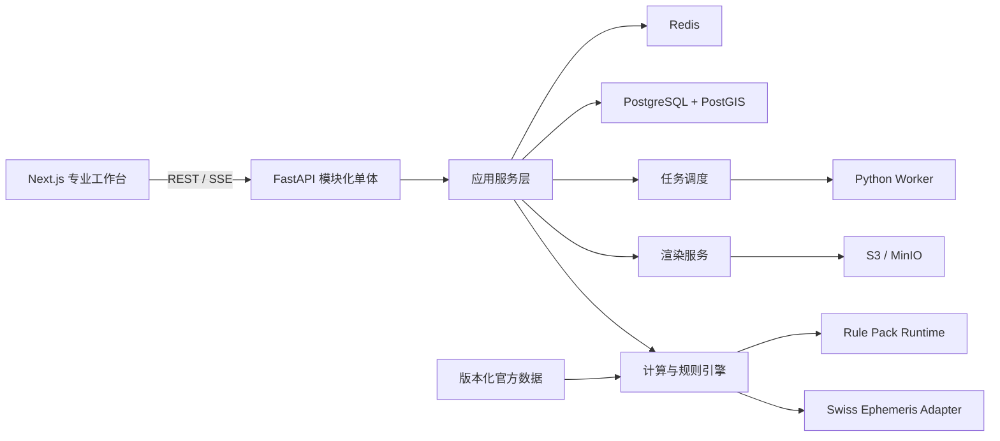

# Interstellar V1 技术开发说明书

| 字段 | 值 |
|---|---|
| 文档版本 | 1.0.0-draft.1 |
| 基线日期 | 2026-07-17 |
| 产品版本 | Interstellar V1 |
| 研发周期 | 24 个月；第 6 个月交付 Professional Alpha |
| 目标读者 | 产品负责人、开发者、测试人员、占星算法审核者、运维人员 |
| 技术栈 | Next.js + TypeScript；FastAPI + Python；PostgreSQL/PostGIS；Redis；S3/MinIO |
| 发布方式 | AGPL 开源；公共限流服务；Docker Compose 自托管 |

本说明书是 V1 的研发基线。开发任务、接口、数据模型、测试和发布验收均以本文及 [能力矩阵](./capabilities.yaml) 为准。涉及占星流派差异或复杂公式的工作项，必须先根据[算法卡模板](./algorithm-card-template.md)完成算法卡；没有算法卡的能力不得标记为 `Stable`。

## 1. 目标、范围与约束

### 1.1 V1 目标

构建面向职业占星师、占星学习者和重度爱好者的西方占星专业计算平台，提供：

- 可复现、可追溯、可验证的确定性占星计算；
- 专业 Web 工作台与版本化 REST API；
- 本命、预测、关系、古典、卜卦、择时、地理和世运能力；
- 结构化证据链，不输出没有依据的综合评分；
- 中英文界面、字段、错误和开发文档；
- SVG/PNG/PDF/JSON/CSV/ICS/项目归档导出；
- 匿名计算和可选云端工作区；
- 允许后续接入新占术系统的公共平台协议。

### 1.2 V1 不做

- AI 解读、AI 对话、自然语言控制；
- 普通消费者简化模式、每日推送和订阅内容；
- CRM、预约、支付、咨询交付、团队协作；
- 八字、紫微斗数、奇门遁甲和印度占星的领域实现；
- 原生 iOS/Android 应用；
- 企业级 SLA、多区域高可用和大规模分析仓库；
- 商业 App 内容抓取、专有规则逆向或 Astro-Databank 爬取；
- 付费数据源和闭源发行。

### 1.3 强制工程原则

1. **计算与解释分离**：计算引擎只输出事实和规则命中，文本层不反向修改计算结果。
2. **输入不可歧义**：未知出生时间不得自动写成 `00:00`；历史时区存在多个候选时必须返回候选集和可信度。
3. **结果不可变**：每次计算生成不可变 `CalculationSnapshot`，引用准确的对象版本、引擎版本、数据版本和规则哈希。
4. **流派显式**：宫位制、黄道体系、Ayanamsa、容许度、尊贵表和技法变体不得使用隐式默认值。
5. **能力分级**：所有能力标注 `Stable`、`Beta` 或 `Experimental`。
6. **零爬虫**：核心数据仅通过官方发布包、Dump、API、TAP 或经授权人工导入获取。
7. **可替换适配器**：Canonical Schema 不依赖 Kerykeion、Swiss Ephemeris 或任一具体库的返回结构。
8. **同源渲染**：屏幕和导出共享 `RenderSpec`，避免前后端各自解释计算结果。

## 2. 总体架构



### 2.1 模块化单体边界

| 模块 | 主要职责 | 禁止职责 |
|---|---|---|
| `identity` | 用户、会话、Workspace、权限 | 占星计算 |
| `subjects` | Subject、SubjectVersion、关系与项目对象 | 修改历史版本 |
| `time_location` | TimeSpec、地名、时区候选、历史警告 | 隐式修正用户时间 |
| `calculations` | 请求标准化、计算流水线、快照 | 生成长篇解释文本 |
| `techniques` | 本命、预测、关系、古典等领域算法 | 直接依赖 HTTP/UI |
| `rules` | Rule Pack 校验、哈希、执行、证据 | 执行未授权代码 |
| `rendering` | RenderSpec、SVG/PNG/PDF、图表布局 | 重算天体位置 |
| `jobs` | 长任务、进度、取消、重试、超时 | 持有领域状态真相 |
| `datasets` | 数据版本、来源、许可证、同步状态 | 静默更新线上结果 |
| `imports_exports` | CSV/JSON/ICS/项目归档 | 导出明文密钥或凭据 |
| `sharing` | 可撤销、可过期分享 | 永久公开私有对象 |
| `observability` | 日志、指标、审计、追踪 | 记录明文出生资料 |

### 2.2 建议仓库结构

```text
apps/
  web/                    Next.js 工作台
  api/                    FastAPI 应用与模块
  worker/                 异步任务 Worker
packages/
  canonical-schema/       OpenAPI/JSON Schema/生成类型
  render-spec/            渲染协议和前端组件
  ui/                     共享设计系统
python/
  interstellar_core/      领域模型、计算流水线、适配器
  interstellar_rules/     Rule Pack 编译和运行时
  interstellar_render/    服务端渲染
data-manifests/           官方数据版本与许可证清单
algorithm-cards/          已批准算法卡
tests/
  gold/                   金标准样本
  differential/           独立实现差异测试
  contracts/              API/Schema 契约
docs/                     研发与项目文档
```

`packages/canonical-schema` 是跨语言契约的唯一来源。Python 和 TypeScript 类型由 Schema 生成，不允许维护两套手写、可能漂移的公共类型。

### 2.3 固定实现选型

| 层 | 选型 | 约束 |
|---|---|---|
| Web | Next.js App Router、TypeScript strict、React、TanStack Query、Zod | 服务端状态由Query管理；只在确有跨视图交互状态时使用轻量Store |
| UI | CSS Variables设计令牌、Radix Primitives或等价无障碍基础组件 | 不绑定商业组件库；打印和深浅主题共享令牌 |
| API | FastAPI、Pydantic v2、SQLAlchemy 2 async、Alembic、psycopg | 路由不得直接调用Swiss；必须经过应用服务和领域接口 |
| Worker | Celery 5 + Redis broker | Job真相写PostgreSQL；Celery结果后端不作为公共状态来源 |
| 数据库 | PostgreSQL + PostGIS | JSONB快照不可变；租户表强制RLS |
| 对象存储 | S3兼容接口；本地MinIO | 数据库只保存对象键、哈希、大小和MIME |
| Schema | JSON Schema + OpenAPI | 使用代码生成产出TS/Python客户端模型 |
| 测试 | Pytest、Hypothesis、Vitest、Playwright | 金标准和差异测试作为独立测试套件 |
| 渲染 | 浏览器TypeScript SVG组件；Playwright确定性导出PNG/PDF | 服务端导出调用内部只读渲染路由，复用同一RenderSpec和组件 |

运行时版本通过仓库工具版本文件和锁文件固定；升级框架或计算库必须独立提交，并先运行契约、金标准和视觉回归。

## 3. 研发工作包

每个工作包必须在 Issue 中引用对应编号、能力矩阵 ID 和算法卡 ID。

| ID | 月份 | 优先级 | 工作包 | 依赖 | 主要交付 |
|---|---:|---|---|---|---|
| V1-FND-001 | M0-M1 | P0 | Monorepo、CI、Docker Compose | 无 | 可启动的 Web/API/Worker/Postgres/Redis/MinIO |
| V1-SCH-001 | M0-M1 | P0 | Canonical Schema | FND-001 | 公共类型、OpenAPI、类型生成 |
| V1-TIM-001 | M0-M1 | P0 | TimeSpec 与历史时区 | SCH-001 | 时间候选、可信度、DST异常处理 |
| V1-SUB-001 | M0-M1 | P0 | Subject/Version/Workspace | SCH-001 | 不可变版本和 RLS |
| V1-DAT-001 | M0-M2 | P0 | 数据清单和同步框架 | FND-001 | DatasetVersion、来源和许可台账 |
| V1-ENG-001 | M1-M3 | P0 | 计算流水线与 Swiss Adapter | SCH-001,TIM-001,DAT-001 | 标准化输入到快照 |
| V1-NAT-001 | M2-M4 | P0 | 本命基础计算 | ENG-001 | 天体、轴点、宫位、相位、统计 |
| V1-REL-001 | M3-M5 | P0 | 比较盘与组合盘 | NAT-001 | 跨盘相位、宫位覆盖、组合盘 |
| V1-TRN-001 | M3-M5 | P0 | 行运和返照 | NAT-001,JOBS-001 | 事件命中和太阳/月亮返照 |
| V1-RND-001 | M2-M6 | P0 | 基础渲染 | SCH-001,NAT-001 | 单/双轮、网格、表、PNG/SVG |
| V1-UI-001 | M1-M6 | P0 | 三栏工作台 Alpha | SUB-001,RND-001 | 输入、参数、结果、证据和导出 |
| V1-JOB-001 | M1-M4 | P0 | 异步任务与 SSE | FND-001 | 进度、取消、重试、限流 |
| V1-API-001 | M1-M6 | P0 | 公共 REST API Alpha | SCH-001,ENG-001,JOB-001 | `/api/v1` 契约 |
| V1-SEC-001 | M1-M6 | P0 | 隐私、RLS、加密、分享 | SUB-001 | 安全边界和审计 |
| V1-PRG-001 | M7-M10 | P1 | 次限、三限、太阳弧 | NAT-001 | 推运类快照和时间线 |
| V1-REL-002 | M7-M10 | P1 | 戴维森与动态关系 | REL-001,PRG-001 | 关系盘和动态触发 |
| V1-CLS-001 | M7-M12 | P1 | 尊贵、接纳、格局、阿拉伯点 | NAT-001,RULE-001 | 古典派生指标 |
| V1-MID-001 | M7-M12 | P1 | 中点与谐波 | NAT-001 | 中点树、谐波盘 |
| V1-EVT-001 | M7-M12 | P1 | 统一事件搜索器 | TRN-001,JOB-001 | 区间搜索、精确命中、反复触发 |
| V1-RND-002 | M7-M12 | P1 | 专业图形 Beta | EVT-001,PRG-001 | 三/四轮、图形星历、甘特图、PDF |
| V1-RULE-001 | M7-M13 | P1 | Rule Pack Runtime | SCH-001 | JSON/YAML声明式规则、证据链 |
| V1-TML-001 | M13-M16 | P1 | 小限、法达、黄道释放 | CLS-001,RULE-001 | 时间主星周期 |
| V1-DIR-001 | M13-M18 | P1 | 主限和高级弧向 | PRG-001 | 方向法计算和时间线 |
| V1-HOR-001 | M13-M18 | P1 | 卜卦规则引擎 | CLS-001,RULE-001 | 象征星、接纳、完成规则 |
| V1-ELE-001 | M13-M18 | P1 | 择时约束优化 | EVT-001,RULE-001 | 候选时间扫描和排序 |
| V1-GEO-001 | M13-M18 | P1 | 迁移与地理占星 | TIM-001,DAT-001,RND-002 | A*C*G、Local Space、Paran |
| V1-TOP-001 | M13-M18 | P1 | 结构化主题模型 | RULE-001,TML-001 | 基线、激活、支持、压力、确定度 |
| V1-MUN-001 | M19-M22 | P2 | 世运、国家、公司、项目 | EVT-001,GEO-001 | 组织与事件周期 |
| V1-RND-003 | M19-M23 | P1 | 全图形家族 | 全部计算能力 | 能力矩阵中的 V1 图形 |
| V1-LOC-001 | M19-M23 | P1 | 中英文和无障碍 | UI-001,RND-003 | 双语、打印、键盘、色盲支持 |
| V1-REL-003 | M19-M23 | P1 | SDK、归档与兼容性 | API-001 | TS/Python SDK、可重导入归档 |
| V1-GATE-001 | M23-M24 | P0 | V1 稳定化与审计 | 全部 | 专业评审、许可、安全、性能、发布 |

### 3.1 工作包完成定义

一个工作包只有同时满足以下条件才可关闭：

- 公共输入、输出和错误行为已写入 Schema/OpenAPI；
- 代码不绕过模块边界；
- 算法卡、数据来源和许可证已登记；
- 单元、属性、金标准和必要的差异测试通过；
- UI能力具备键盘操作、空状态、加载、错误和警告状态；
- 日志不包含明文敏感出生资料；
- 文档、示例、变更记录和能力矩阵状态同步；
- 性能预算没有回退，或已记录并批准例外；
- `Stable` 能力完成专业复核。

## 4. Canonical Domain Schema

### 4.1 公共枚举

内部和 API 枚举使用稳定英文值；UI按语言包显示。

```text
SubjectKind       person | event | project | organization | country | relationship | question
TimePrecision     second | minute | quarter_hour | hour | part_of_day | date | interval | unknown
TimeConfidence    high | medium | low | disputed | unknown
Maturity          stable | beta | experimental
JobStatus         queued | running | succeeded | failed | cancelling | cancelled | expired
EvidencePolarity  support | pressure | neutral | counter
ChartFamily       natal | transit | progression | direction | return | relationship | horary |
                  electional | relocation | mundane | harmonic | custom
```

### 4.2 Subject 与版本

```json
{
  "id": "sub_01...",
  "workspace_id": "ws_01...",
  "kind": "person",
  "display_name": "Example",
  "current_version_id": "sv_01...",
  "created_at": "2026-07-17T12:00:00Z"
}
```

```json
{
  "id": "sv_01...",
  "subject_id": "sub_01...",
  "version": 3,
  "time_spec": {},
  "location": {},
  "attributes": {},
  "source": {"kind": "user", "note": null},
  "content_hash": "sha256:...",
  "created_at": "2026-07-17T12:00:00Z"
}
```

规则：

- `SubjectVersion`只允许创建和读取，不提供更新接口；
- 删除 Subject 默认软删除，历史快照保留版本引用；
- 匿名请求使用内联 Subject，不创建 Subject 或 SubjectVersion；
- Relationship 保存参与者版本引用，不复制出生资料；
- Project、Organization、Event 使用相同版本机制。

### 4.3 TimeSpec

```json
{
  "calendar": "gregorian",
  "local_value": "1987-05-10T02:30:00",
  "precision": "minute",
  "timezone_id": "Asia/Shanghai",
  "utc_candidates": ["1987-05-09T18:30:00Z"],
  "selected_utc": "1987-05-09T18:30:00Z",
  "confidence": "high",
  "source": {
    "kind": "user_record",
    "description": "birth certificate"
  },
  "manual_override": null,
  "warnings": []
}
```

约束：

- `precision=unknown`时，`local_value`只允许包含日期，宫位和轴点依赖能力必须拒绝或切换“无出生时间模式”；
- DST重复时返回两个 `utc_candidates`，用户必须选择，或请求以分支结果返回；
- DST空洞时返回 `TIME_NONEXISTENT_LOCAL`，不得自动平移；
- 1970年前的时区转换必须带数据版本和历史可信度；
- 手工修正记录修正前值、修正后值、理由和操作者；
- 儒略历和历史历法转换需独立算法卡。

### 4.4 Location

```json
{
  "name": "Shanghai",
  "country_code": "CN",
  "admin_path": ["Shanghai"],
  "latitude": 31.2304,
  "longitude": 121.4737,
  "elevation_m": 4,
  "timezone_id": "Asia/Shanghai",
  "geonames_id": 1796236,
  "source": "geonames",
  "source_version": "2026-07-17"
}
```

经纬度采用 WGS84；纬度范围 `[-90, 90]`，经度范围 `[-180, 180)`；任何地图服务返回值都必须先规范化为 Location，计算引擎不读取供应商特有字段。

### 4.5 ChartRequest

```json
{
  "subject": {"subject_version_id": "sv_01..."},
  "chart": {
    "family": "natal",
    "technique": "natal.standard",
    "reference_time": null,
    "reference_location": null
  },
  "settings": {
    "zodiac": "tropical",
    "house_system": "P",
    "center": "geocentric",
    "node_type": "true",
    "aspect_set_id": "official.modern_major.v1",
    "orb_profile_id": "official.default.v1"
  },
  "rule_pack_hash": "sha256:...",
  "dataset_versions": {},
  "outputs": ["snapshot", "svg"]
}
```

规范化后的请求必须包含所有默认值，并计算 `input_fingerprint`。同一规范化请求、引擎版本、规则哈希和数据版本必须得到相同结构化结果。

### 4.6 CalculationSnapshot

```json
{
  "id": "calc_01...",
  "schema_version": "1.0.0",
  "status": "succeeded",
  "request": {},
  "normalized_input": {},
  "input_fingerprint": "hmac-sha256:...",
  "engine": {"name": "interstellar-core", "version": "0.1.0"},
  "adapters": [{"name": "swiss-ephemeris", "version": "2.10.x"}],
  "datasets": [],
  "rule_pack_hash": "sha256:...",
  "maturity": "beta",
  "result": {
    "charts": [],
    "points": [],
    "houses": [],
    "aspects": [],
    "patterns": [],
    "periods": [],
    "events": [],
    "topic_evidence": []
  },
  "warnings": [],
  "created_at": "2026-07-17T12:00:01Z"
}
```

快照不可更新。重新计算生成新快照，并可通过 `supersedes_id`建立替代关系。

### 4.7 Evidence

```json
{
  "id": "ev_01...",
  "topic": "career.role_change",
  "polarity": "support",
  "technique": "transit",
  "configuration": {
    "moving_point": "jupiter",
    "aspect": "conjunction",
    "natal_point": "mc",
    "orb_deg": 0.18
  },
  "active_window": {
    "start": "2026-08-12T00:00:00Z",
    "exact": ["2026-09-03T08:14:00Z"],
    "end": "2026-10-01T00:00:00Z"
  },
  "rule_id": "career.transit.jupiter_mc.v1",
  "weight": 0.9,
  "maturity": "beta",
  "sources": ["algorithm-card:TRN-001"]
}
```

V1主题输出只提供 `activity`、`support`、`pressure`、`confidence`和证据列表；不输出“成功概率”“复合概率”或无依据的单一好运分。

## 5. 数据库设计

### 5.1 核心表

| 表 | 关键字段 | 说明 |
|---|---|---|
| `users` | `id`, `email_ciphertext`, `status` | 最少化账户数据 |
| `workspaces` | `id`, `owner_id`, `locale` | V1每用户默认一个个人工作区 |
| `workspace_members` | `workspace_id`, `user_id`, `role` | V1仅owner；保留未来扩展 |
| `subjects` | `id`, `workspace_id`, `kind`, `current_version_id` | 对象元数据 |
| `subject_versions` | `id`, `subject_id`, `version`, `payload_jsonb`, `content_hash` | 不可变对象版本 |
| `calculations` | `id`, `workspace_id?`, `subject_version_id?`, `status`, `fingerprint` | 计算索引 |
| `calculation_snapshots` | `calculation_id`, `schema_version`, `payload_jsonb` | 不可变完整结果 |
| `jobs` | `id`, `kind`, `status`, `progress`, `lease_until`, `error_code` | 长任务状态 |
| `rule_packs` | `id`, `workspace_id?`, `name`, `status` | 规则包元数据 |
| `rule_pack_versions` | `id`, `rule_pack_id`, `content`, `content_hash` | 不可变规则版本 |
| `dataset_versions` | `id`, `dataset_id`, `version`, `checksum`, `license` | 数据来源与版本 |
| `render_artifacts` | `id`, `calculation_id`, `render_spec_hash`, `object_key` | 导出物索引 |
| `share_links` | `id`, `resource_id`, `token_hash`, `expires_at`, `revoked_at` | 仅保存令牌哈希 |
| `audit_events` | `id`, `workspace_id`, `action`, `metadata_jsonb` | 不含敏感值 |

### 5.2 存储规则

- 所有租户表包含 `workspace_id`并启用 PostgreSQL RLS；
- 出生资料、备注和私有自定义字段在进入数据库前使用应用层信封加密；
- `calculation_snapshots.payload_jsonb`只追加、不更新；
- 长期大批量结果按月份或计算类型分区；大型导出写入对象存储；
- Redis只保存短期缓存、锁、队列和进度，不作为业务真相；
- 公共计算缓存键使用服务端 HMAC，不使用可被猜测的明文出生资料哈希；
- 匿名结果默认仅存在请求生命周期；用户显式导出或保存后才持久化；
- 迁移必须向前可执行，并为不可逆迁移提供备份和恢复说明。

## 6. API 契约

### 6.1 通用协议

- Base URL：`/api/v1`；
- JSON字段使用 `snake_case`；时间使用 ISO 8601；角度使用十进制度；
- 写接口接受 `Idempotency-Key`；
- 列表使用游标分页 `page[cursor]`、`page[limit]`，默认20、最大100；
- 错误采用统一 `application/problem+json`；
- 公共托管响应包含速率限制头；
- Schema不兼容变化只能发布 `/api/v2`。

错误结构：

```json
{
  "type": "https://interstellar.dev/problems/time-ambiguous",
  "title": "Local time maps to multiple UTC instants",
  "status": 422,
  "code": "TIME_AMBIGUOUS_LOCAL",
  "detail": "Select one UTC candidate or request branch calculation.",
  "instance": "/api/v1/calculations",
  "fields": {"subject.time_spec.utc_candidates": ["...", "..."]},
  "request_id": "req_01..."
}
```

| HTTP | 用途 |
|---:|---|
| 400 | JSON或查询参数格式错误 |
| 401/403 | 未认证或无Workspace权限 |
| 404 | 资源不存在或不可见 |
| 409 | 幂等冲突、版本冲突、Schema不兼容 |
| 422 | 领域校验错误、时间歧义、参数不支持 |
| 429 | 限流或并发任务超限 |
| 503 | 数据集/计算适配器不可用；可重试 |

### 6.2 创建计算

`POST /api/v1/calculations`

- 小于同步预算的请求返回 `201 CalculationSnapshot`；
- 超出同步预算或显式指定 `Prefer: respond-async`时返回 `202 Job`；
- 同步预算默认为预计CPU时间500ms、搜索点不超过10,000；具体值可配置但行为必须可观测；
- 匿名请求不得引用私有 Subject；已登录请求可以选择内联且不保存。

响应 `202`：

```json
{
  "job": {
    "id": "job_01...",
    "status": "queued",
    "progress": 0,
    "links": {
      "self": "/api/v1/jobs/job_01...",
      "events": "/api/v1/jobs/job_01.../events",
      "cancel": "/api/v1/jobs/job_01.../cancel"
    }
  }
}
```

### 6.3 读取计算

`GET /api/v1/calculations/{id}`返回不可变快照。匿名计算只有在使用短期签名访问令牌时可读取，令牌不写入日志。

### 6.4 渲染

`POST /api/v1/renders`

```json
{
  "calculation_id": "calc_01...",
  "render_spec": {
    "view": "wheel.bi_wheel",
    "locale": "zh-CN",
    "theme": "print_light",
    "width": 1600,
    "height": 1600,
    "layers": ["houses", "points", "major_aspects"],
    "accessibility": {"color_blind_safe": true}
  },
  "format": "svg"
}
```

- SVG可以同步返回；PNG/PDF或多页报告默认异步；
- 相同快照和 RenderSpec 哈希允许复用已生成导出物；
- RenderSpec不得包含可执行代码或外部未授权资源URL。

### 6.5 Jobs 与 SSE

`GET /api/v1/jobs/{id}/events`使用 `text/event-stream`：

```text
event: progress
data: {"status":"running","progress":42,"stage":"event_search"}

event: completed
data: {"status":"succeeded","resource":"/api/v1/calculations/calc_01..."}
```

- 客户端用 `Last-Event-ID`恢复；
- 任务终态后事件流关闭；
- `POST /api/v1/jobs/{id}/cancel`幂等；
- Worker每30秒续租，租约失效的任务可重新排队；
- 默认普通长任务超时5分钟，批量任务30分钟；
- 确定性错误不重试，临时基础设施错误最多指数退避重试3次。

### 6.6 Subjects、Rule Packs、Datasets

```text
POST /subjects
GET  /subjects
GET  /subjects/{id}
POST /subjects/{id}/versions
GET  /subjects/{id}/versions
DELETE /subjects/{id}

POST /rule-packs
POST /rule-packs/{id}/versions
POST /rule-packs/validate
GET  /rule-packs/{id}/versions/{version}

GET  /datasets
GET  /datasets/{id}/versions
GET  /datasets/{id}/versions/{version}

GET  /calculations
POST /jobs/{id}/cancel

POST /imports/project-archives
POST /exports/project-archives
GET  /artifacts/{id}

POST /shares
GET  /shares/{token}
DELETE /shares/{id}
```

V1不提供更新或删除 SubjectVersion/RulePackVersion 的接口。Rule Pack发布新版本后，旧计算继续引用旧哈希。

### 6.7 认证与会话

- 匿名计算不创建账户或会话；
- 公共托管使用无密码Email Magic Link，账户邮箱规范化后加密保存；
- Next.js负责登录界面，FastAPI签发短期访问令牌和可轮换HttpOnly刷新Cookie；
- 访问令牌有效期15分钟，刷新会话默认30天并支持服务端撤销；
- 自托管通过SMTP配置发送Magic Link；开发环境只允许将链接输出到专用本地邮件捕获器，不写普通应用日志；
- API自动化访问使用带作用域、到期时间和Workspace绑定的Personal Access Token；
- CSRF防护使用SameSite Cookie、Origin校验和状态变更请求令牌；
- V1不实现社交关系、组织邀请和多成员协作，`workspace_members`仅为未来兼容保留。

## 7. 计算引擎

### 7.1 流水线


### 7.2 适配器策略

- Swiss Ephemeris/pyswisseph是 V1 天文事实权威；
- Kerykeion可用于 Alpha 加速轮盘和通用能力，但只能经 Adapter 转为 Canonical Schema；
- JPL SPICE/DE用于关键位置和时间的独立验证，不直接承担占星语义；
- Immanuel、Flatlib或其他库只作为差异测试参考，禁止把互相冲突的结果静默合并；
- 每个 Adapter 返回版本、输入参数、警告和原始精度；
- 替换 Adapter 不得改变公共 API 结构。

### 7.3 精度与容差

具体容差由算法卡定义。默认测试预算：

| 指标 | Stable默认容差 |
|---|---:|
| 主要天体地心黄经 | ≤ 0.0001° |
| 月亮地心黄经 | ≤ 0.0005° |
| 轴点和宫头 | ≤ 0.001°，高纬异常除外 |
| 精确相位命中时间 | 快行星≤60秒；慢行星≤5分钟 |
| 返照精确时刻 | ≤60秒 |
| SVG几何定位 | ≤1 CSS px（固定视口） |

如果参考实现采用不同岁差、章动、Delta T、地心/拓扑中心或宫位算法，测试必须先对齐参数，不能直接用输出差异判定错误。

### 7.4 Rule Pack

托管服务只接受声明式 JSON/YAML，不执行用户代码。基本结构：

```yaml
schema_version: 1.0.0
id: user.example.career
version: 1.0.0
extends: official.topic-core.v1
rules:
  - id: career.jupiter_mc
    when:
      all:
        - fact: aspect.moving_point
          equals: jupiter
        - fact: aspect.natal_point
          equals: mc
        - fact: aspect.type
          in: [conjunction, trine, sextile]
    emit:
      topic: career.visibility
      polarity: support
      weight: 0.8
```

约束：

- 发布前执行 JSON Schema、引用、循环、类型和资源预算校验；
- 表达式不允许网络、文件、系统时间、随机数和反射；
- 每个规则包具备最大规则数、最大递归深度和执行时间；
- 自托管管理员未来可安装受信任代码插件，但不属于公共托管V1。

## 8. 前端工作台

### 8.1 信息架构

```text
顶部：新建 / 当前对象 / 时间 / 技法 / 运行 / 撤销重做 / 保存 / 导出
左侧：人物 / 事件 / 项目 / 关系 / 问题 / 案例 / 导入
中央：主图 + 标签页 + 最多四分屏
底部：位置 / 宫位 / 相位 / 尊贵 / 周期 / 事件数据坞
右侧：输入 | 参数 | 结果 | 证据
```

### 8.2 核心流程

**匿名计算**

1. 点击“新建计算”；
2. 输入日期、时间精度、地点和盘型；
3. 解决时间歧义或接受历史警告；
4. 运行计算；
5. 中央显示主图，底部显示数据，右侧显示结果和证据；
6. 可直接导出；保存到云端时再要求登录。

**云端研究**

1. 在左侧创建或选择对象；
2. 选择精确 SubjectVersion；
3. 使用 Preset设置技法和参数；
4. 运行并产生不可变快照；
5. 将多个快照置于分屏、同步时间或高亮；
6. 保存 Workspace布局或导出项目归档。

### 8.3 状态要求

每个视图必须实现：

- 未输入空状态；
- 参数校验和字段级错误；
- 时间歧义候选选择；
- 运行中进度和取消；
- 部分数据降级和来源警告；
- 计算失败的可操作错误；
- Stable/Beta/Experimental标签；
- 数据、算法、规则和快照版本入口；
- 键盘导航、可见焦点、色盲安全和打印样式。

移动端只保证查看、基础计算和分享，不提供多分屏、高密度专业编辑和大型地图工作流。

## 9. 图形和导出

### 9.1 RenderSpec 分层

1. `ChartModel`：Canonical Snapshot中的计算事实；
2. `RenderSpec`：视图、尺寸、主题、可见层、标签和交互配置；
3. `LayoutModel`：符号避让、轨道半径、相位线、分页；
4. `Artifact`：SVG/PNG/PDF或前端Canvas/WebGL场景。

### 9.2 V1图形家族

- 单轮、双轮、三轮、四轮和自定义多轮；
- 比较盘、组合盘、戴维森盘和关系周期对照；
- 行星、宫头、相位、尊贵、固定星、阿拉伯点和中点表；
- 相位矩阵、跨盘矩阵、中点树、定位星链和相位网络；
- 行运甘特、图形星历、逆行/进入/相位/返照日历；
- 次限、太阳弧、主限、小限、法达、黄道释放时间线；
- Astrocartography、Local Space、Paran、迁移和食相路径地图；
- 45°、90°、360°刻度盘、谐波轮盘和赤纬图；
- 结构化主题活跃度、支持度、压力度和证据时间图。

详细图形条目和阶段以 `capabilities.yaml` 为准。

### 9.3 导出契约

- SVG保留可读分组、语义ID和可访问标题；
- PNG支持透明背景和1x/2x/4x；
- PDF嵌入字体或使用许可明确的字体子集；
- JSON是完整快照；CSV按表分别导出并附元数据；
- ICS只导出用户选择的时间事件并包含时区；
- 项目归档为版本化ZIP，包含manifest、对象版本、快照、Rule Pack和可选渲染物；
- 导入先校验校验和、Schema版本和压缩炸弹风险，再写入新Workspace资源。

## 10. 数据同步与许可证

数据必须先同步到本地版本库或缓存，再供运行时使用；线上计算不实时依赖第三方公共接口。

| ID | 来源 | 获取 | V1用途 | 许可/要求 | 同步策略 |
|---|---|---|---|---|---|
| swiss_ephemeris | [Astrodienst](https://www.astro.com/swisseph/swephinfo_e.htm) | 官方代码和数据发布 | 主要天体、月球、宫位、轴点、小行星 | AGPL或专业许可；V1选AGPL | 锁版本；升级先跑金标准 |
| jpl_spice | [NASA/JPL NAIF](https://naif.jpl.nasa.gov/naif/public.html) | 官方Kernel | 独立天文校验 | 全球公众免费；按要求署名 | 按选定DE内核人工升级 |
| iana_tzdb | [IANA](https://www.iana.org/time-zones) | 官方tar包 | 历史UTC偏移和DST | 免费发布；记录版本 | 每版检测；2026-07基线为2026c |
| timezone_boundaries | [Timezone Boundary Builder](https://github.com/evansiroky/timezone-boundary-builder) | GitHub Release | 经纬度到IANA时区 | 输出ODbL；代码MIT | 跟随所用tzdb版本 |
| geonames | [GeoNames Dump](https://download.geonames.org/export/dump/) | 官方Dump和增量 | 地名、别名、经纬度、时区ID | CC BY 4.0署名 | 月度全量、每日增量可选 |
| natural_earth | [Natural Earth](https://www.naturalearthdata.com/about/terms-of-use/) | 官方包 | 全球底图、静态导出 | 公有领域 | 半年检查 |
| osm | [OpenStreetMap](https://www.openstreetmap.org/copyright) | 自建Extract或可替换供应商 | 详细交互底图 | ODbL与署名；服务另有政策 | 不依赖公共Nominatim/Tile生产SLA |
| iers | [IERS Bulletins](https://data.iers.org/bulletins.php) | A/B/C/D Bulletin | EOP、闰秒、DUT1 | 官方公开数据 | A每周、B/C/D发布时更新 |
| mpc | [Minor Planet Center](https://docs.minorplanetcenter.net/software/) | mpc_orb JSON | 任意小行星按需计算 | 遵守官方使用说明和来源标注 | 常用对象内置，其他按需缓存 |
| gaia_dr3 | [ESA Gaia DR3](https://gea.esac.esa.int/archive/documentation/GDR3/index.html) | TAP/Archive | 固定星天文参数 | 开放免费；署名ESA/Gaia/DPAC | 常用固定星内置，其他按需缓存 |
| nasa_eclipse | [NASA Eclipse](https://eclipse.gsfc.nasa.gov/eclipse.html) | 官方目录 | 日月食回归测试和历史页 | 可复用并按指定文本致谢 | 静态版本，算法运行时自算 |
| wikidata | [Wikidata](https://www.wikidata.org/wiki/Wikidata:Licensing) | Dump/API | 精选公开案例基础信息 | 结构化数据CC0 | 人工筛选并记录原始来源 |

每个 `DatasetVersion`保存：来源URL、版本、发布日期、下载时间、SHA-256、许可SPDX/文本、署名、适用范围、已知缺陷和同步日志。

### 10.1 明确禁止

- 不爬取 Astro-Databank；若未来使用其资料，必须取得书面商业授权并保留Rodden Rating和原始来源；
- 不使用公共 Nominatim做自动完成、批量地理编码或生产关键依赖；
- 不抓取Google地图、商业星盘图、商业报告或付费数据库；
- 不把网页搜索结果当成可复现的计算数据版本；
- 不将免费数据等同于免费托管服务，地图瓦片和大规模查询需自建或采购。

## 11. 安全、隐私与审计

- 匿名计算默认无服务器持久化；
- 已登录数据以Workspace为安全边界并强制RLS；
- 私有字段使用每Workspace数据密钥，主密钥由部署环境提供；
- 字段加密采用AES-256-GCM，每条记录使用唯一随机nonce并将表名、记录ID、字段名作为AAD；数据密钥由部署主密钥包裹；
- 密钥轮换不修改业务ID，轮换过程可恢复；
- 密码less登录令牌、刷新令牌、PAT和分享令牌只保存带服务端pepper的哈希；
- API令牌只显示一次，以哈希保存，支持作用域和到期时间；
- 分享令牌至少128位随机熵，只保存哈希，可到期、撤销和限制下载；
- 日志只记录请求ID、工作包、耗时、版本和错误码，不记录明文出生资料、备注、令牌和导出内容；
- Rule Pack输入需防止资源耗尽和YAML对象注入；
- 项目归档导入需防路径穿越、恶意压缩和Schema欺骗；
- 删除账户时删除Workspace私有数据和对象存储文件，保留去标识化运营指标；
- V1不是端到端加密产品；服务器执行计算时会解密工作区字段。

## 12. 性能、可靠性与运维

### 12.1 性能预算

- 未缓存普通单盘：`p95 < 2s`；
- 缓存命中：`p95 < 300ms`；
- 工作台首次可交互：目标 `p75 < 2.5s`（桌面宽带）；
- 同步请求硬超时：10秒；超过预计预算应转异步；
- SVG单图默认不超过5MB；超出时提示减少层或使用Canvas；
- 公共服务按IP和账户双重限流；默认匿名30次/小时、账户300次/小时，部署方可配置并公开。

### 12.2 降级顺序

1. 禁止新的批量任务；
2. 延迟非关键导出和地图任务；
3. 只允许基础单盘计算；
4. 保持已有结果读取和下载；
5. 数据集损坏或版本缺失时拒绝计算，不使用未知版本替代。

### 12.3 可观测性

关键指标：请求量、错误率、p50/p95/p99、队列深度、任务年龄、缓存命中、数据版本、Adapter错误、渲染失败、限流次数、RLS拒绝、导入失败。

每个请求贯穿 `request_id`和OpenTelemetry trace；日志、指标和追踪均不得包含敏感字段。

### 12.4 Docker Compose交付

V1 Compose包含：`web`、`api`、`worker`、`postgres-postgis`、`redis`、`minio`和一次性`migrate`/`dataset-sync`任务。必须提供：

- `.env.example`和安全默认值说明；
- 健康检查和依赖就绪检查；
- 数据库与对象存储备份脚本；
- 从备份恢复演练；
- 数据库迁移和数据集升级手册；
- 单机升级的短暂停机流程。

## 13. 测试与发布门禁

### 13.1 测试层级

| 类型 | 必须覆盖 |
|---|---|
| 单元测试 | 公式、坐标转换、容许度、宫位归属、规则表达式 |
| 属性测试 | 角度归一化、对称性、周期性、往返序列化、不变量 |
| 金标准 | 已批准出生盘、返照、预测命中、地理线和古典技法 |
| 差异测试 | Swiss/JPL及独立占星实现；参数先对齐 |
| 契约测试 | OpenAPI、JSON Schema、SDK、错误码、幂等 |
| 数据测试 | 校验和、版本、许可、署名、字段完整性、升级回归 |
| 安全测试 | RLS、越权、令牌、归档、Rule Pack、字段加密 |
| 视觉回归 | SVG/PNG/PDF固定视口和字体；打印与色盲主题 |
| E2E | 匿名排盘、保存版本、分屏比较、长任务、导出重导入 |
| 性能测试 | 单盘、缓存、年度搜索、地图、批量任务和并发限流 |

### 13.2 必测边界场景

- DST重复时刻、DST不存在时刻；
- 只知道日期、上午/下午或一小时时间区间；
- 1970年前历史时区存在争议；
- 高纬度宫位不可计算或极端变形；
- 格里高利历/儒略历边界和公元前日期；
- 逆行造成同一相位三次精确命中；
- 跨0°黄经的组合盘中点和相位；
- 相同请求在数据升级前后形成不同快照但均可复现；
- 用户修改对象后，旧快照仍指向旧SubjectVersion；
- SSE断线恢复、取消竞争、Worker租约失效和重复投递；
- 导出归档后重新导入，结构化结果哈希保持一致；
- Workspace A无法读取Workspace B的任何对象、快照或导出物。

### 13.3 成熟度门禁

| 级别 | 条件 |
|---|---|
| Experimental | 有算法卡草案、单元测试和显著警告；API可能变更 |
| Beta | 算法卡批准、金标准和差异测试通过；边界或专业复核未完成 |
| Stable | Beta条件 + 专业复核 + 兼容性承诺 + 完整文档 + 性能预算通过 |

任何未满足 Stable 条件的功能即使已经上线，也必须保留 Beta/Experimental 标签。

## 14. 里程碑验收

### 14.1 Professional Alpha（M6）

- 本命、行运、比较、组合、太阳返照、月亮返照可用；
- 支持主要天体、轴点、宫位、主要相位、逆行、元素和模式；
- 单轮、双轮、相位网格、位置表和基础时间线可用；
- 匿名计算和云端对象版本工作流完整；
- SVG/PNG/JSON/CSV可导出；
- REST、异步任务、SSE、取消和限流可用；
- 关键时间和天体位置通过金标准与差异测试；
- Docker Compose可在全新机器上按文档启动。

### 14.2 V1（M24）

- `capabilities.yaml`中所有 `v1_required: true` 条目已实现；
- 条目至少达到其 `target_maturity`，未达标条目不得伪装完成；
- 全部公开接口有契约测试、中英文文档和示例；
- 全部计算结果可由版本元数据复现；
- 完成数据和开源许可证审计；
- 完成隐私、安全、性能和备份恢复演练；
- 完成至少一轮职业占星师专业评审；
- 发布已知限制清单和V1后路线。

## 15. 首个八周开发顺序

| 周 | 工作 | 可验证结果 |
|---:|---|---|
| 1 | Monorepo、Compose、CI、代码质量 | 一条命令启动空工作台和API |
| 2 | Canonical Schema骨架、类型生成 | TS/Python类型由同一Schema生成 |
| 3 | Workspace、Subject、SubjectVersion、RLS | 对象版本不可修改且跨Workspace隔离 |
| 4 | TimeSpec、Location、IANA tzdb | 正常、重复、不存在、未知时间测试通过 |
| 5 | DatasetVersion、Manifest、Swiss Adapter | 返回太阳/月亮/行星规范化位置 |
| 6 | Calculation流水线和快照 | 相同请求可复现、旧结果不可变 |
| 7 | Jobs、Redis队列、SSE、取消 | 长任务状态机E2E通过 |
| 8 | 三栏工作台第一个纵向切片 | 输入一人资料并展示结构化位置表 |

第一个纵向切片不等待完整星盘图，先验证输入—时间—计算—快照—读取—呈现的全链路；第9周开始并行扩展本命计算和SVG轮盘。

## 16. 已知限制

以下问题不得由开发者自行“补值”解决：

- 1970年前部分时区没有唯一可靠历史答案；
- 出生时间校正没有通用标准答案；
- 精确公众人物出生时间缺少统一合法开放数据库；
- 主题权重和现实事件概率没有行业公认标准；
- Gaia、OSM和全部小行星全量镜像不适合单机低成本V1；
- 免费开放数据覆盖确定性计算，但不附带专业解释文本、专业评审和生产托管SLA；
- 闭源商业部署前必须重新评估Swiss Ephemeris专业许可。

处理原则是返回可信度、候选结果、来源和警告，并将尚未验证的能力降级为Beta或Experimental。
